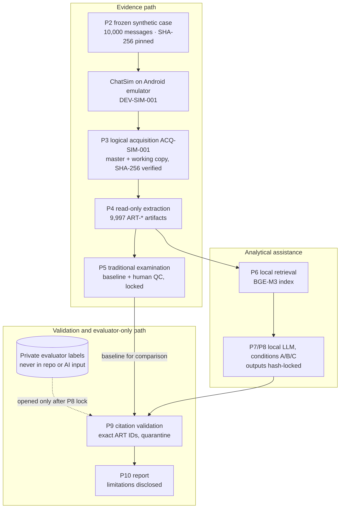

# Libera

**A forensic-first study of local AI assistance over controlled synthetic conversational evidence.**

Libera acquires a synthetic Indonesian WhatsApp-style case from a researcher-controlled Android app,
preserves it with SHA-256, extracts traceable artifacts and examines them with a traditional baseline.
Only then does it test a local retrieval-augmented LLM, whose outputs are hash-locked and checked
against the acquired evidence. The project is complete; this repository is its archived final snapshot.

[](https://github.com/krissimbolon/libera/actions/workflows/post-p2-integration.yml)


> [!NOTE]
> Libera is a controlled research simulation. The evidence carrier (**ChatSim**) is **not WhatsApp**, the
> acquisition is **logical, on an Android emulator**, and nothing here is validated for casework or court use.

## Overview

Digital examiners increasingly look to language models for help with large chat extractions, but model
output is probabilistic and can cite evidence that does not exist. Libera asks what it takes to add such
assistance *without* weakening the forensic chain:

- **Controlled evidence.** A 10,000-message synthetic case, structurally adapted from a public court record
  and frozen by hash, is loaded onto ChatSim (`DEV-SIM-001`).
- **Forensic workflow first.** Logical acquisition (`ACQ-SIM-001`), master/working copies with SHA-256,
  read-only extraction into `ART-*` artifacts, and a deterministic examiner baseline with human QC.
- **Local AI second.** BGE-M3 retrieval and Qwen2.5 1.5B through Ollama on loopback; no case data leaves
  the machine.
- **Validation over trust.** Outputs are locked before any evaluation label is opened; every cited
  identifier is checked; invalid ones are quarantined and reported, never repaired.

## Research question

> Can local AI assistance be inserted **after** acquisition and traditional forensic examination while
> keeping every analytical claim traceable to acquired evidence?

Sub-questions (workflow, retrieval, structured output, failure modes, examiner role) are in
[docs/01_research_design/research_design.md](docs/01_research_design/research_design.md).

## System at a glance



## Key design principles

- **Evidence first.** AI consumes only acquired P4 artifacts; source reconstruction and design metadata are
  never examiner or model input.
- **Immutable corpus.** The P2 corpus is frozen; CI fails if a byte changes.
- **Local-first.** Model calls are restricted to loopback, without redirects or proxies.
- **Provenance.** Every artifact carries acquisition and device IDs; every run logs model digest and
  parameters.
- **Fail closed.** Locks refuse dry-runs, errors, incomplete or unregistered executions; extraction refuses a
  working copy whose hash differs from the acquisition record.
- **No hidden correction.** Invalid model citations and failed runs stay in the record.
- **Evaluation separated from generation.** Labels are opened only after outputs are locked.

## Repository structure

```text
libera/
├── src/
│   ├── forensics/        P3 dry-run acquisition simulator, P4 trusted-hash extraction
│   ├── baseline/         P5 traditional baseline, examiner packet, P5 lock
│   ├── ai_rag/           P6 chunking/retrieval, P7/P8 runner, loopback transport, output validation
│   ├── evaluation/       P9 precheck, citation quarantine, label evaluation
│   ├── report/           P10 report builder
│   ├── security/         integrity and separation guards
│   └── audit_*.py …      P2 corpus construction/audit tooling (historical; corpus frozen)
├── tools/                ChatSim extraction, seed builder, P8/GT locks, verifiers, doc link checker
├── scripts/              Windows PowerShell runners (acquire → extract → P5–P10, P9 final, workbench)
├── workbench/            Streamlit examiner workbench (read-only SQLite)
├── apps/libera-chatsim/  Android evidence carrier (APK built in CI)
├── configs/              registered P6–P8 config and investigation tasks T01–T10
├── data/                 frozen P2 corpus, anchors, reconstruction metadata (no verbatim source text)
├── references/           source, model and dataset registry
├── tests/                74 automated tests (synthetic fixtures only)
├── docs/                 current documentation + historical archive (see docs/README.md)
└── archive/              legacy v0 prototype (not part of the final method)
```

## Reproducibility

Full manifest: **[docs/reproducibility.md](docs/reproducibility.md)**.

**Publicly reproducible (clone + Python only).** Corpus integrity, the complete test suite, the P3–P10
pipeline on a software dry-run carrier with a deterministic hashing embedding, the lock's refusal of that
dry-run, citation-quarantine logic, the extractor's tamper refusal, and the ChatSim seed build.

**Locally reproducible with tools and models.** The ChatSim acquisition and the real A/B/C experiment need
Windows PowerShell, Python ≥ 3.12, Android SDK Platform-Tools and an emulator, the CI-built ChatSim APK, and
Ollama with `bge-m3` and `qwen2.5:1.5b`. Model output is repeatable only for the same model digest, runtime
and hardware.

**Intentionally excluded.** Acquired SQLite masters and working copies, runtime outputs of the reported run,
private evaluator labels, court-record originals, credentials and device identifiers. They are kept out of
Git by design; the published results can be traced to their recorded hashes but not recomputed from a clone.

## Frozen dataset

| | |
|---|---|
| Path | `data/adaptasi_indonesia/corpus_whatsapp_10000.csv` |
| Rows | 10,000 (500 adapted anchors, 6,500 context, 1,500 bridge, 1,500 distractors) |
| SHA-256 | `a014a02ebad298a33267da8631f3a2d1906a537ae558c1849622904c225467e6` |
| Status | `FROZEN_FOR_FORENSIC_SIMULATION` since 2026-09-24 (`716216f`); byte-protected by `.gitattributes` |

All identities are fictional. The 500 anchors were independently reconstructed, fictionalized and localized from the structure of messages described in the public U.S. federal court record [*United States v. Matthew Woods*, No. 17-CR-1235-WJ, Document 547](https://www.govinfo.gov/content/pkg/USCOURTS-nmd-1_17-cr-01235/pdf/USCOURTS-nmd-1_17-cr-01235-9.pdf); no verbatim source text is stored in the public corpus.

## Environment

| | Tested |
|---|---|
| Public pipeline and tests | Linux, Python 3.12, 3.13, 3.14 (CI: 3.12 and 3.14) |
| Acquisition and real experiment | Windows (build 26200), Python 3.14, ADB 1.0.41 (Platform-Tools 37.0.1), Android emulator, Ollama with `qwen2.5:1.5b` and `bge-m3` |
| ChatSim APK | Java 17, Gradle 8.9 (GitHub Actions) |

Other platforms have not been tested.

## Quick start

```bash
git clone https://github.com/krissimbolon/libera.git
cd libera
python -m pip install -e ".[test]"   # pytest only; the pipeline itself uses the standard library
python -m pytest                     # 74 tests, no network or models
```

Smoke run of the whole pipeline (software dry-run carrier, no model calls — not a study result):

```bash
python -m src.forensics.acquisition_simulator && python -m src.forensics.extract_artifacts
python -m src.baseline.traditional_baseline
python -m src.ai_rag.chunker --input runtime/working/P4/artifacts.csv --output runtime/working/P6/chunks.jsonl --min-size 30 --max-size 60 --time-window-minutes 120
python -m src.ai_rag.retriever build --chunks runtime/working/P6/chunks.jsonl --namespace case_evidence --index runtime/working/P6/index.json --embedding-method hashing
python -m src.ai_rag.run_experiment --dry-run --index runtime/working/P6/index.json --questions configs/investigation_tasks.json --output runtime/working/P8/experiment_output.json
python -m src.evaluation.evaluate_experiment && python -m src.report.build_report
```

Real local experiment on Windows (emulator with ChatSim, Ollama running):

```powershell
powershell -ExecutionPolicy Bypass -File scripts\run_libera_demo.ps1 -StopAfterP4
powershell -ExecutionPolicy Bypass -File scripts\run_p5_examiner_review.ps1 -ArtifactsPath <artifacts.csv>
powershell -ExecutionPolicy Bypass -File scripts\run_libera_local.ps1 -ArtifactsPath <artifacts.csv> -UseLockedP5
```

## Integrity and evidence model

- **Acquisition identity.** `DEV-SIM-001` / `ACQ-SIM-001` for the study; `ACQ-DRY-001` marks software
  dry-runs and is never presented as a device acquisition.
- **Hash preservation.** The app database is copied to a master and a working copy; both hashes must match
  the acquisition record before extraction. A structurally valid but modified copy is refused.
- **Artifact IDs.** Each acquired message becomes `ART-000001…` with acquisition and device IDs; evaluator
  fields are never part of the artifact schema.
- **Locks.** P5 is locked before AI. P8 outputs, inputs, config, tasks and run log are hash-locked; the lock
  refuses dry-run, errored, incomplete or unregistered executions and never overwrites an existing lock.
- **Output validation.** A citation counts only if it is an exact `ART-` ID that exists in P4 and was supplied
  to that condition. By default, label-based scoring is refused when any citation is invalid; the documented
  quarantine policy must be chosen explicitly.

## AI experiment

| Condition | Model input | Purpose |
|---|---|---|
| **A** | Investigation question only, no case evidence | Negative control |
| **B** | Question + top-8 retrieved artifacts | Evidence-assisted answer |
| **C** | Same retrieval as B + JSON schema output | Tests whether structure improves auditability |

Reported run (2026-09-25, prompt `v6-forensic-grounded-repeat-control`): 30/30 real responses, no transport
errors, 10/10 C outputs schema-valid, 14/14 lock hashes verified. A JSON schema constrains *format*; it does
not make cited evidence valid.

## Results

**Observed system behaviour.** The pipeline completed acquisition → examination → locked AI run → validation
with every step hash-recorded. Earlier attempts (v3–v5) that stopped on malformed or truncated output were
kept separately and not reported as results.

**Citation integrity.**

| | A | B | C |
|---|---:|---:|---:|
| References submitted | 0 | 10 | 24 |
| Valid (exact, in P4, supplied to condition) | 0 | 10 | 12 |
| Quarantined | 0 | 0 | 12 |

**Provenance proxy.** Because the original private semantic ground truth was lost and not recreated, P9
used a proxy derived from corpus design (adapted anchor vs. designed distractor, 1,997 labelled messages,
chosen after outputs were seen). Retrieval for B selected anchors with precision 0.56 / recall 0.28; the P5
baseline 0.65 / 0.09. Of the valid citations, only 3 (B) and 2 (C) fell inside the labelled subset, and one
of them (C) was an anchor. These numbers measure design-reference selection, **not** semantic accuracy.

**True semantic ground truth.** Not available. No claim is made that RAG or structured output is more
accurate. Full tables and caveats: [docs/final_state.md](docs/final_state.md).

## Limitations

- Synthetic case; ChatSim is a controlled carrier, not WhatsApp; no real or seized device.
- Logical app-private acquisition on an emulator, not physical or full-file-system acquisition.
- One small local model and one embedding model; one run per condition.
- No independent semantic ground truth; claim-level human review not performed.
- The public corpus carries provenance labels, so strict evaluator blindness cannot be claimed.
- Not a validated forensic tool; no claim of legal admissibility.

## Documentation

- [Final state, results and limitations](docs/final_state.md)
- [Reproducibility manifest](docs/reproducibility.md)
- [Documentation map](docs/README.md)
- [Historical development archive](docs/README.md#historical-archive)

## Citation

Citation metadata is in [CITATION.cff](CITATION.cff) (GitHub's "Cite this repository" uses it). Please cite
the tagged snapshot `v1.0.0`.

## License

No license has been granted for this repository yet, so default copyright applies: the code and
documentation may be read and cited, but reuse needs permission from the authors. Data has separate
constraints:

- The frozen corpus is the authors' synthetic work derived structurally from a public court record that
  contains sensitive material; redistribution terms have not been formally reviewed.
- Third-party models (Qwen2.5 — Apache-2.0; BGE-M3 — MIT) are not redistributed here.
- Legacy inputs in `archive/legacy-v0-synthesizer/` have unverified redistribution terms.

See [references/source_registry.csv](references/source_registry.csv) for per-source status.

## Acknowledgements and key references

NIST SP 800-101 Rev. 1 (mobile device forensics); SWGDE mobile evidence best practices; Lewis et al. 2020
(retrieval-augmented generation); Chen et al. 2024 (BGE-M3); Qwen2/Qwen2.5 technical reports; MITRE ATT&CK
T1565.001. The complete list is in [references/source_registry.csv](references/source_registry.csv).
