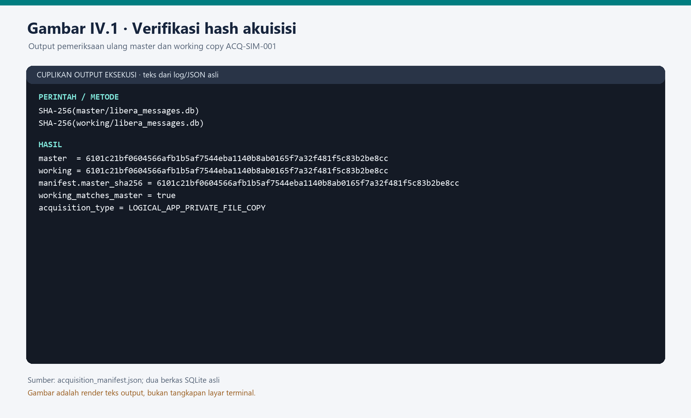
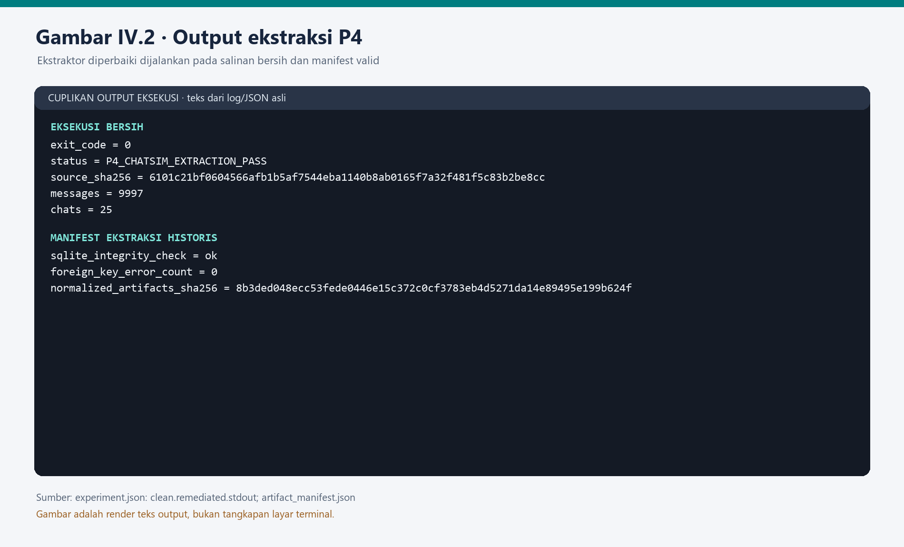
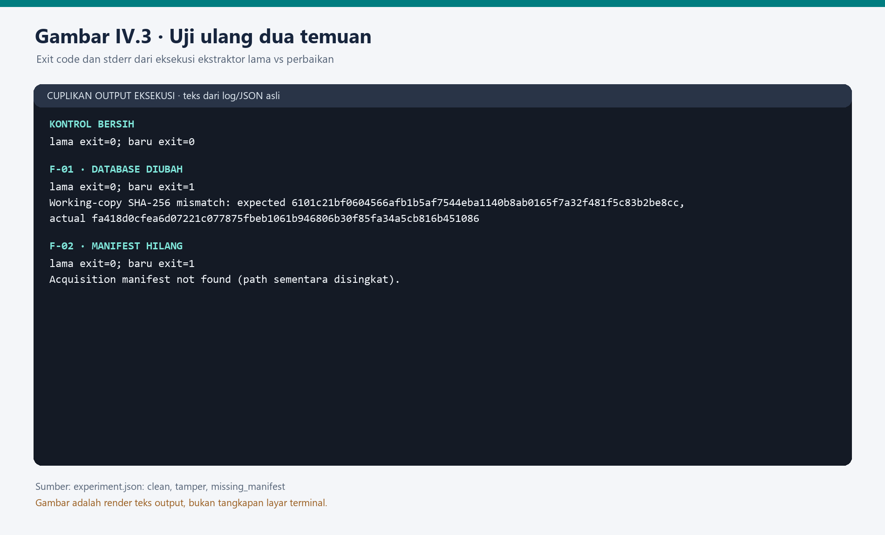
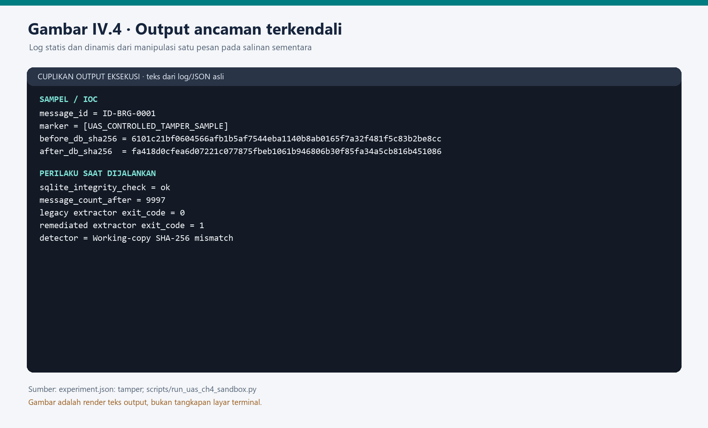
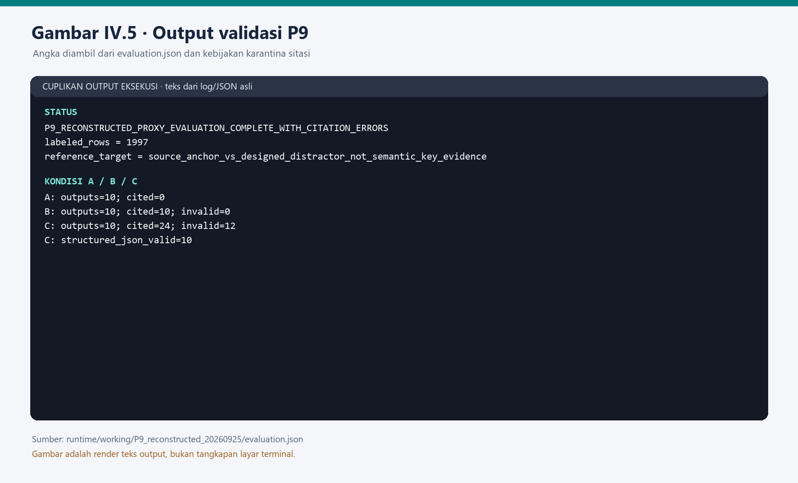

# BAB IV — HASIL IMPLEMENTASI DAN PENGUJIAN

Bab ini melaporkan pengamanan dan pengujian pada lingkungan penelitian Libera. Corpus percakapan bergaya WhatsApp adalah sintetis; bukti yang benar-benar diakuisisi berasal dari aplikasi **Libera ChatSim** pada **emulator Android**, melalui penyalinan logis basis data milik aplikasi dengan ADB dan `run-as`. Perangkat diberi ID `DEV-SIM-001` dan akuisisi `ACQ-SIM-001`. Pengujian keamanan tambahan pada bab ini hanya menyentuh **salinan sementara** dari berkas kerja. Karena itu, hasilnya tidak boleh ditafsirkan sebagai forensik WhatsApp, akuisisi sistem berkas penuh, atau insiden pada sistem statistik yang beroperasi [1].

## 4.1 Implementasi Pengamanan

### 4.1.1 Integritas data sumber dan akuisisi

Corpus P2 dibekukan pada 10.000 pesan dengan SHA-256 `a014a02ebad298a33267da8631f3a2d1906a537ae558c1849622904c225467e6`. Pada tahap P3, basis data ChatSim disalin sebagai **master** dan **working copy**. Pemeriksaan ulang terhadap dua berkas yang tersedia menghasilkan SHA-256 yang sama, `6101c21bf0604566afb1b5af7544eba1140b8ab0165f7a32f481f5c83b2be8cc`, sesuai `acquisition_manifest.json`. Pemeriksaan dilakukan sebelum ekstraksi, sehingga perubahan pada salinan kerja dapat dibedakan dari keadaan akuisisi. Pendekatan preservasi, akuisisi, pemeriksaan, analisis, dan pelaporan ini sejalan dengan tahapan forensik perangkat bergerak yang dijelaskan NIST SP 800-101 Rev. 1 [1]. Kesamaan hash membuktikan kesamaan byte dua berkas pada saat diperiksa; hal itu sendiri tidak membuktikan bahwa semua 10.000 pesan desain telah berada pada aplikasi.

*Gambar IV.1. Cuplikan output penghitungan ulang SHA-256 master dan working copy `ACQ-SIM-001`. Sumber: `acquisition_manifest.json` dan kedua berkas SQLite, 3 Oktober 2026; teks log ditata ulang agar terbaca.*

Ekstraksi P4 membaca working copy tanpa menulis ke master. Manifest ekstraksi melaporkan `PRAGMA integrity_check = ok`, nol kesalahan foreign key, **9.997 artefak pesan** dan **25 chat**. SHA-256 `artifacts.csv` adalah `8b3ded048ecc53fede0446e15c372c0cf3783eb4d5271da14e89495e199b624f`. Tiga pesan desain tidak muncul pada universe akuisisi; laporan ini tidak menetapkan penyebabnya tanpa log staging yang memadai. Pesan yang tidak terakuisisi tidak diperlakukan sebagai bukti negatif atau dinilai sebagai hasil model.

*Gambar IV.2. Cuplikan stdout ekstraktor pada salinan bersih dan nilai manifest P4 historis. Sumber: `bab4_evidence/experiment.json` dan `artifact_manifest.json`; teks log ditata ulang agar terbaca.*

### 4.1.2 Pemisahan bukti, salinan kerja, dan ground truth

Artefak yang diteruskan kepada pemeriksa memakai pengenal `ART-*`, ID akuisisi/perangkat, waktu, pengirim, penerima, dan isi pesan. Skema ini tidak memasukkan label evaluator seperti `is_key_evidence` atau `expected_entity_ids`. Baseline P5 menggunakan kata kunci, urutan waktu, frekuensi aktor, dan relasi pasangan; manifest P5 mencatat **10 tugas**, **26 aktor**, serta **25 relasi**. Tahap AI menerima artefak P4, sedangkan label evaluasi disimpan terpisah. Output eksperimen P8 dan berkas input terkait dikunci dengan hash sebelum evaluasi P9; rekaman verifikasi lock menunjukkan **14 dari 14** berkas cocok. Pemisahan ini mengurangi risiko jawaban model tercemar oleh label evaluasi, tetapi tidak menghilangkan bias yang melekat pada desain kasus sintetis.

### 4.1.3 Penguatan gerbang ekstraksi dan validasi sitasi

Audit kode menemukan bahwa ekstraktor ChatSim sebelumnya memeriksa konsistensi internal SQLite, tetapi tidak membandingkan hash berkas kerja dengan hash pada manifest akuisisi. Tanpa manifest, kode lama meneruskan ekstraksi dengan identitas `ACQ-SIM-UNKNOWN` dan `DEV-SIM-UNKNOWN`. Perbaikan yang diterapkan pada `tools/extract_acquired_chatsim.py` mewajibkan manifest yang dapat dibaca, `working_sha256` yang valid, kecocokan SHA-256 berkas sebelum ekspor, serta `acquisition_id` dan `device_id`. Saat syarat itu gagal, ekstraksi berhenti sebelum membuat artefak. Keputusan ini menjaga hubungan artefak dengan salinan kerja yang telah dicatat saat akuisisi.

Pada keluaran AI, kebijakan `p9-strict-citation-quarantine-v1` hanya menerima pengenal `ART-` yang berbentuk tepat, ada dalam artefak P4, dan memang disediakan kepada kondisi eksperimen tersebut. Keluaran model asli tidak ditulis ulang. Referensi yang gagal tetap dilaporkan sebagai kesalahan dan dikeluarkan dari kredit bukti. Penguncian dan karantina merupakan **kontrol deteksi dan validasi**; keduanya tidak memperbaiki kemampuan model menghasilkan referensi yang benar.

| Kontrol | Kondisi awal | Kondisi setelah pengamanan | Bukti |
|---|---|---|---|
| Hash master–working | Master dan working sudah memiliki hash pada manifest | Hash dihitung ulang; keduanya identik | Manifest P3; Gambar IV.1 |
| Kelayakan basis data | Pemeriksaan struktur `integrity_check` dan foreign key | Tetap dijalankan bersama pemeriksaan hash sumber | Manifest P4; Gambar IV.2 |
| Keterikatan working copy ke manifest | Ekstraktor lama menerima berkas yang berubah dan manifest yang hilang | Ekstraktor baru menolak kedua kondisi; input asli tetap diterima | Eksperimen sandbox; Gambar IV.3 |
| Pemisahan label evaluator | Skema P4 tidak memuat GT | Lock P8 diverifikasi sebelum P9 | Manifest P4; `lock_verification.json` |
| Validitas referensi AI | Keluaran C mengandung referensi tidak sah | 12 referensi dikarantina, kesalahan tetap terlihat | Evaluasi P9; Gambar IV.5 |

## 4.2 Hasil Pengujian dan Analisis Kerentanan

Pengujian dilakukan dengan salinan sementara working SQLite, salinan manifest, serta output P8 yang sudah terkunci. **Tidak ada perubahan terhadap master maupun working copy kanonik.** Untuk dua uji ekstraktor, pembanding *sebelum* adalah snapshot kode dari `HEAD` sebelum perbaikan; pembanding *sesudah* adalah kode yang diperbaiki. Uji kontrol menggunakan salinan asli beserta manifest tetap berhasil pada kedua versi (`exit code 0`). Tingkat risiko di bawah bersifat **kualitatif**, berdasarkan kemungkinan pada lingkungan kerja berizin dan dampaknya terhadap integritas/ketertelusuran bukti. CVSS tidak dipakai untuk kelemahan prosedural dan kualitas keluaran AI karena skor eksploitasi teknis jaringan tidak akan menggambarkannya dengan tepat.

*Gambar IV.3. Exit code dan pesan penolakan dari tiga skenario pada ekstraktor lama dan baru. Sumber: `bab4_evidence/experiment.json`, dijalankan pada salinan sementara 3 Oktober 2026; path temporer disingkat pada gambar dan lengkap pada log mentah.*

**F-01 — Perubahan isi working SQLite tetap lolos pemeriksaan struktur (risiko tinggi).** Satu isi pesan pada salinan sementara diubah melalui `UPDATE` SQLite. Basis data tetap mengembalikan `integrity_check = ok` dan tetap berisi 9.997 pesan. SHA-256 berubah dari `6101c21bf0604566afb1b5af7544eba1140b8ab0165f7a32f481f5c83b2be8cc` menjadi `fa418d0cfea6d07221c077875fbeb1061b946806b30f85fa34a5cb816b451086`. Ekstraktor lama mengembalikan `exit code 0` dan mengekspor artefak. Akar sebabnya ialah pemeriksaan struktur SQLite tidak memverifikasi bahwa isi berkas sama dengan bukti akuisisi. Dampaknya, perubahan yang valid secara struktur dapat masuk ke analisis dan mengubah linimasa atau interpretasi. Setelah pemeriksaan SHA-256 terhadap manifest diterapkan, uji ulang menghasilkan `exit code 1` dengan pesan *Working-copy SHA-256 mismatch*, sedangkan salinan bersih tetap `exit code 0`. Risiko residu: pihak yang dapat mengganti berkas dan manifest sekaligus masih dapat membuat pasangan hash baru; karena itu manifest perlu disimpan dengan kontrol akses, pengesahan, dan rantai penguasaan bukti yang terpisah.

**F-02 — Manifest akuisisi hilang tetapi ekstraksi tetap berjalan (risiko sedang).** Ketika manifest dihapus **hanya dari salinan uji**, ekstraktor lama mengembalikan `exit code 0` dan memakai identitas akuisisi/perangkat `UNKNOWN`. Akar sebabnya ialah fallback yang mengizinkan ekspor tanpa provenance. Dampaknya ialah artefak tidak dapat dihubungkan secara meyakinkan ke sumber akuisisi dan pemeriksanya dapat salah menggabungkan bukti. Perbaikan mengubah kondisi ini menjadi *fail closed*: manifest wajib ada dan memuat ID serta hash. Uji ulang menghasilkan `exit code 1` dengan pesan *Acquisition manifest not found*. Salinan bersih dengan manifest masih lulus. Risiko residu: keberadaan dan hash manifest belum setara dengan tanda tangan digital atau chain of custody lengkap.

**F-03 — Referensi AI terstruktur tidak seluruhnya sah (risiko sedang).** Pada 10 jawaban kondisi C, model mengajukan **24 kemunculan referensi**; **12 diterima** dan **12 dikarantina** karena format atau hubungan dengan bukti yang tersedia tidak memenuhi kebijakan. Enam tugas terdampak. Akar sebab yang dapat dibuktikan ialah keluaran model generatif tidak selalu mengikuti kontrak pengenal artefak; eksperimen ini tidak mengisolasi sebab internal model atau retrieval secara kausal. Bila referensi tersebut langsung dikreditkan, narasi dapat tampak didukung oleh bukti yang tidak tersedia. Kebijakan validasi diterapkan setelah output P8 dikunci: pengenal yang salah tidak dipadankan secara perkiraan dan tidak diberi kredit. Uji ulang terhadap output yang sama menunjukkan 12 referensi tidak sah tetap tercatat tetapi **nol** di antaranya diterima sebagai sitasi terverifikasi. Perbaikan ini bersifat **containment**, bukan perbaikan generasi model; risiko keluaran baru yang keliru masih ada dan harus ditangani dengan validasi per jawaban serta telaah pemeriksa.

| ID | Bukti reproduksi | Akar sebab | Perbaikan dan hasil uji ulang | Risiko residu |
|---|---|---|---|---|
| F-01 | SQLite `ok`, hash berubah, ekstraktor lama `0` | Hanya validasi struktur | Verifikasi SHA-256; salinan termutasi ditolak (`1`) | Manifest dan berkas dapat diganti bersamaan |
| F-02 | Tanpa manifest, ekstraktor lama `0` | Fallback identitas `UNKNOWN` | Manifest wajib; uji ulang ditolak (`1`) | Perlu chain of custody/pengesahan manifest |
| F-03 | 12/24 referensi C tidak sah | Keluaran generatif melanggar kontrak ID | 12 dikarantina; 0 diberi kredit | Model masih menghasilkan kesalahan |

## 4.3 Analisis Ancaman Manipulasi Bukti

Sampel uji pada subbab ini adalah **skrip manipulasi terkendali**, bukan malware yang ditemukan di luar proyek. Berkas `scripts/run_uas_ch4_sandbox.py` memiliki SHA-256 `f779a33ce6a97a856d7f61cf73f21b19b90bb6dfb26aed7c5b8feacb62f5559a` pada eksperimen yang dilaporkan. Skrip hanya menyalin SQLite dan manifest ke direktori temporer, menambah penanda `[UAS_CONTROLLED_TAMPER_SAMPLE]` ke isi satu pesan (`ID-BRG-0001`), lalu menjalankan ekstraktor lama dan versi perbaikan. Berkas akuisisi asli dibaca untuk verifikasi dan tidak ditulis. Pemetaan MITRE ATT&CK yang tepat untuk **manipulasi data yang tersimpan pada host/salinan kerja** ialah `T1565.001 – Stored Data Manipulation`, taktik *Impact* [2]. Pemetaan ini menyatakan kesamaan teknik pada skenario laboratorium, bukan bukti adanya aktor jahat nyata.

**Analisis statis.** Pemeriksaan skrip menunjukkan satu operasi `UPDATE messages SET message_text=? WHERE message_id=?`, tanpa kode penyebaran atau koneksi ke target eksternal. Indikator pada sampel ialah penanda teks di atas, ID pesan yang disentuh, dan perubahan SHA-256 basis data menjadi `fa418d0cfea6d07221c077875fbeb1061b946806b30f85fa34a5cb816b451086`. Hash tersebut adalah IoC **khusus salinan uji**, bukan indikator malware umum. Perubahan hash isi pesan dan basis data dicatat pada `experiment.json`; lokasi direktori temporer tidak dijadikan bukti permanen.

**Analisis dinamis.** Setelah mutasi, SQLite masih lolos pemeriksaan integritas internal dan jumlah pesan tidak berubah. Ekstraktor lama menjalankan seluruh ekspor (`exit code 0`), menunjukkan bahwa pemeriksaan struktur saja tidak mendeteksi manipulasi. Ekstraktor baru menghentikan proses sebelum ekspor (`exit code 1`) ketika hash berbeda dari manifest. Pada pengujian negatif, salinan asli dan manifest valid tetap diekstrak (`exit code 0`). Dengan demikian, kemampuan solusi yang dibuktikan adalah **deteksi dan penolakan manipulasi berkas kerja yang manifestnya tetap dipercaya**. Tidak ada bukti bahwa sistem ini mendeteksi penyerang yang dapat mengubah manifest, kompromi host, atau mutasi memori saat aplikasi berjalan. Strategi MITRE untuk deteksi manipulasi data tersimpan juga menekankan pemantauan perubahan tak sah pada file dan basis data [2].

*Gambar IV.4. Nilai hash, pemeriksaan struktur, jumlah pesan, serta exit code sebelum dan setelah kontrol dari log uji salinan SQLite. Sumber: `bab4_evidence/experiment.json`; teks output ditata ulang agar terbaca.*

## 4.4 Evaluasi Pencapaian Tujuan

Pengujian Bab IV menunjukkan bahwa integritas byte master–working dapat diverifikasi, ekstraksi P4 menghasilkan artefak yang dapat ditelusuri, serta gerbang ekstraksi yang diperbaiki menolak dua kondisi yang sebelumnya diterima. Pengujian ancaman menunjukkan deteksi pada salinan kerja termutasi, dengan ruang lingkup terbatas seperti dijelaskan di 4.3. Tiga temuan F-01–F-03 memiliki hasil reproduksi dan pemeriksaan setelah kontrol; khusus F-03, kontrol hanya mengarantina kesalahan dan tidak mengurangi frekuensi model membuatnya.

Pada baseline tradisional, P5 menyelesaikan 10 tugas dan menghasilkan linimasa/relasi dari artefak P4. Eksperimen P8 menjalankan tiga kondisi pada tugas yang sama: A (LLM tanpa bukti kasus), B (LLM + RAG), dan C (LLM + RAG + format forensik terstruktur). **30 dari 30 respons** selesai tanpa error transport; **10 dari 10** respons C valid menurut skema JSON. Namun validitas format tidak menjamin validitas sitasi: B mengajukan 10 referensi yang seluruhnya diterima, sedangkan C hanya 12 dari 24 yang diterima. A memang tidak diberi bukti kasus dan tidak menghasilkan sitasi. Gambar IV.5 menampilkan hasil kontrol sitasi, bukan skor ketepatan fakta.

*Gambar IV.5. Status evaluasi proxy dan validitas referensi A/B/C dari `evaluation.json`; gambar menampilkan cuplikan output, bukan rekayasa tampilan aplikasi.*

Evaluasi P9 yang tersedia menggunakan **referensi proxy provenance pasca-eksperimen**, karena ground truth semantik independen tidak tersedia. Dari 9.997 pesan terakuisisi, hanya **1.997** masuk universe berlabel proxy: **497** anchor sumber dan **1.500** distractor desain; **8.000** pesan context/bridge tidak berlabel. Tiga anchor sumber tidak terakuisisi. Metrik berikut mengukur kemampuan memilih *source anchor* dibanding *designed distractor* pada subset itu; metrik ini **bukan** precision atau recall bukti kunci semantik, akurasi kesimpulan investigasi, maupun pembandingan model yang teruji secara blind.

| Set prediksi (proxy) | TP | FP | FN | TN | Precision | Recall | F1 |
|---|---:|---:|---:|---:|---:|---:|---:|
| P5 baseline | 45 | 24 | 452 | 1.476 | 0,652 | 0,091 | 0,159 |
| A citations | 0 | 0 | 497 | 1.500 | 0* | 0 | 0 |
| B citations | 0 | 3 | 497 | 1.497 | 0 | 0 | 0 |
| C citations | 1 | 1 | 496 | 1.499 | 0,500 | 0,002 | 0,004 |
| B retrieval | 137 | 107 | 360 | 1.393 | 0,561 | 0,276 | 0,370 |

\* Precision A secara matematis tidak terdefinisi karena tidak ada prediksi positif; `0` di tabel mengikuti konvensi penyimpanan evaluator. Ke-8.000 pesan yang tidak berlabel tidak dihitung sebagai negatif. Prediksi di luar subset berlabel dilaporkan terpisah dalam `evaluation.json`. Nilai retrieval B dan sitasi B/C tidak boleh disamakan karena tahap yang diukur berbeda.

| Tujuan/metrik Bab III.3 | Hasil aktual | Penilaian |
|---|---|---|
| Kesamaan hash master–working | Dua SHA-256 identik | Tercapai untuk berkas yang tersedia |
| Validitas ekstraksi | 9.997 artefak; 25 chat; SQLite `ok`; FK error 0 | Tercapai pada data terakuisisi; selisih tiga pesan belum dijelaskan |
| Tolak working copy termutasi | Sebelum lolos; setelah perbaikan ditolak | Tercapai untuk mutasi berkas dengan manifest tetap |
| Tolak akuisisi tanpa manifest | Sebelum lolos; setelah perbaikan ditolak | Tercapai pada uji salinan |
| Validasi referensi AI | 12/24 referensi C diterima; 12 dikarantina | Kontrol validasi bekerja; kualitas keluaran C belum memadai |
| Akurasi bukti kunci semantik | GT semantik independen tidak tersedia | Belum dapat dinilai |

Secara keseluruhan, pengamanan baru memperkuat **integritas dan provenance** pada gerbang ekstraksi, dan karantina mencegah sitasi tidak sah dipakai sebagai bukti. Temuan yang belum selesai ialah pemulihan/penjelasan tiga pesan yang tidak terakuisisi, evaluasi semantik independen, serta pengesahan manifest yang tahan terhadap penggantian berkas dan manifest sekaligus. Hasil laboratorium ini menjadi masukan risiko untuk rancangan pengelolaan keamanan data dan layanan TI pada Bab V.

### Rujukan khusus Bab IV

[1] R. Ayers, S. Brothers, dan W. Jansen, *Guidelines on Mobile Device Forensics*, NIST SP 800-101 Rev. 1, 2014. https://csrc.nist.gov/pubs/sp/800/101/r1/final

[2] MITRE ATT&CK, *Data Manipulation: Stored Data Manipulation (T1565.001)*. https://attack.mitre.org/techniques/T1565/001/

**Jejak internal:** `demo_evidence/ACQ-SIM-001_20260925_010848/`, `runtime/working/P5/`, `runtime/working/P8_final_v6_20260925/`, `runtime/working/P9_reconstructed_20260925/`, `docs/06_report/bab4_evidence/experiment.json`, dan `scripts/run_uas_ch4_sandbox.py`.
