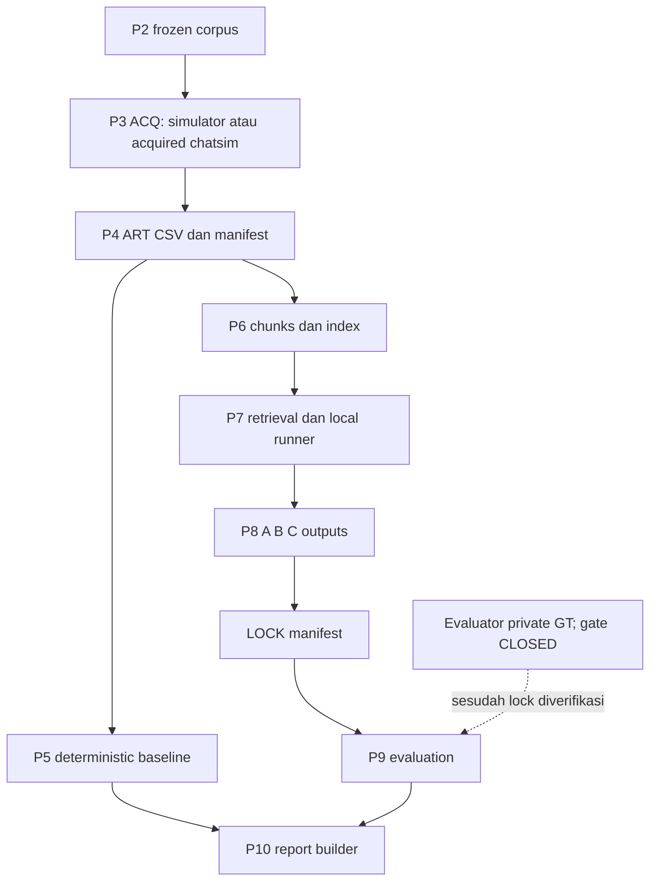
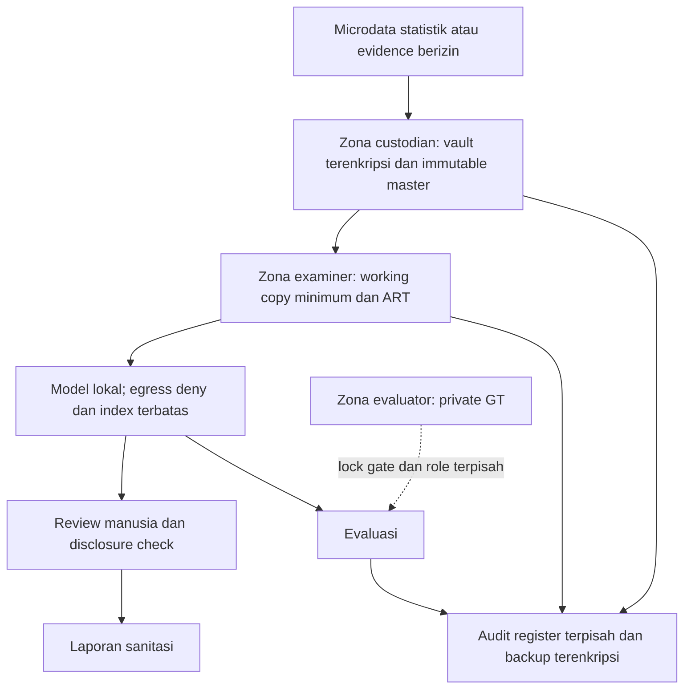

# W4 — Bab V: tata kelola LIBERA

Status: VERIFIED_BY_WORKER untuk inspeksi dan demonstrasi yang dirujuk; usulan pengendalian tetap CANDIDATE. Contract 1.0. Cakupan: prototipe riset kasus sintetis, bukan implementasi BPS, bukti perkara nyata, sertifikasi, atau penetapan kepatuhan hukum. Baseline kode yang diperiksa tercatat pada `evidence/W4/source_inventory.json`; perubahan W1/W2/W3 harus ditinjau ulang Coordinator sebelum menganggap temuan sebagai kondisi akhir.

## V.1 Pelindungan data dan DPIA

UU 27/2022 Pasal 1 menilai identifiabilitas termasuk kombinasi informasi; Pasal 20 mengatur dasar pemrosesan, Pasal 34 penilaian dampak bagi pemrosesan berisiko tinggi, Pasal 35–39 keamanan, dan Pasal 42–45 pengakhiran serta penghapusan. Pasal 46 mewajibkan pemberitahuan tertulis paling lambat 3 x 24 jam kepada subjek dan lembaga; isi minimal mencakup data terungkap, waktu/cara pengungkapan, serta penanganan/pemulihan. Pengecualian Pasal 50 bukan izin otomatis bagi tugas kuliah. Rujukan: [JDIH Komdigi, UU 27/2022](https://jdih.komdigi.go.id/produk_hukum/view/id/832/t/undangundang%20nomor%2027%20tahun%202022), diperiksa 3 Oktober 2026. Penentuan pengendali, dasar hukum, dan izin data nyata belum tersedia: BLOCKED untuk penggunaan nyata.

Konteks statistik: UU 16/1997 Pasal 21 mewajibkan kerahasiaan keterangan responden; Pasal 24 meneruskannya bagi petugas dan Pasal 23 mengatur penyampaian hasil sebagaimana adanya. Ini menjadi dasar kebutuhan arsitektur target statistik, bukan pernyataan bahwa chat sintetis LIBERA merupakan survei resmi BPS. Rujukan [salinan BPS](https://ppid.bps.go.id/upload/doc/UU_Nomor_16_Tahun_1997_tentang_Statistik_1726565451.pdf), Pasal 21–24, diperiksa 3 Oktober 2026.

### Register pemrosesan dan klasifikasi rancangan

| Data/proses | Tujuan dan penerima | Klasifikasi rancangan | Batas dan perlakuan |
|---|---|---|---|
| P2 corpus sintetis | Simulasi dan pengujian fondasi oleh W1 | Internal riset; distribusi sesuai izin sumber | Beku; hash tidak diganti; jangan menyatakan seluruh aset repo bebas data pribadi tanpa audit terpisah |
| ACQ master, DEV metadata, chain of custody | Menelusuri sumber oleh examiner | Terbatas; sangat rahasia apabila nyata | Usulan master read-only, akses custodian, salinan kerja; hash bukan enkripsi |
| P4 ART message_text, sender, timestamp | Analisis deterministik/RAG examiner | Terbatas; potensi identifikasi ulang jika nyata | Saring kolom sesuai contract; minimisasi laporan bukan mengubah master |
| Index, prompt, output FND | Analisis model lokal dan reviewer | Sama dengan bahan paling sensitif | Index/embedding tidak dianggap anonim; local host default bukan bukti tanpa trafik keluar |
| Ground truth evaluator | P9 setelah LOCK | Sangat terbatas | Tidak dibuka W4; isolasi dari examiner dan Git |
| Laporan publik | Dosen/pembaca | Publik setelah review | Kutipan minimal, pseudonim, tanpa kontak/NIK/alamat nyata; checker identifiabilitas |
| Usulan microdata responden statistik | Investigasi insiden institusi oleh tim berizin | Sangat rahasia | Bukan input studi ini; dasar hukum, mandat, retensi dan SOP harus disahkan lebih dahulu |

Alur DPIA rancangan: dokumentasikan mandat dan tujuan spesifik; inventaris semua data turunan; nilai kebutuhan setiap kolom; tentukan pengendali/prosesor serta penerima; periksa hak subjek dan risiko; pilih kontrol; uji kontrol; minta persetujuan penanggung jawab sebelum data nyata. Consent tidak otomatis menjadi dasar yang tepat untuk forensik. Penggunaan teknologi baru, data spesifik, skala besar, atau keputusan berdampak signifikan harus diperiksa terhadap Pasal 34, bukan diasumsikan dari label “AI”. Temuan LLM diperiksa manusia dan tidak menjadi keputusan terhadap orang secara otomatis.

### Risiko DPIA: skor analitis rancangan

Skala kemungkinan L dan dampak I masing-masing 1–5; R=L×I. 1–4 rendah, 5–9 sedang, 10–15 tinggi, 16–25 kritis. Angka merupakan penilaian penulis, bukan pengukuran frekuensi atau probabilitas insiden. Residual adalah target setelah verifikasi kontrol, bukan nilai kondisi akhir.

| Risiko dan pihak terdampak | L,I,R awal | Mitigasi usulan dan pemilik fungsional | Residual target | Bukti penerimaan yang dibutuhkan |
|---|---|---|---|---|
| Pengungkapan chat/contact kepada pihak tak berizin; subjek/korban | 4,5,20 | Custodian: ACL, disk encryption, offline processing, ekspor tersaring | 2,5,10 | Uji akses ditolak, bukti enkripsi dan review ekspor |
| Reidentifikasi dari lokasi/waktu/relasi; responden | 4,4,16 | Privacy reviewer: minimisasi, generalisasi, manual disclosure review | 2,4,8 | Uji quasi-identifier pada output representatif |
| FND tidak didukung menuduh seseorang; subjek | 3,5,15 | Examiner/reviewer: ART citations, penilaian semantik, uncertainty, human signoff | 2,5,10 | Review claim-level; bukan sekadar ART ID ada |
| Tampering master/hasil; pemeriksa dan proses akademik | 3,5,15 | Custodian: master immutable, hash di register terpisah, chain of custody | 1,5,5 | Tamper test dan restore; reviewer independen |
| GT terbaca sebelum lock; validitas riset | 3,4,12 | Coordinator/evaluator: gate dan kontrol akun terpisah | 1,4,4 | Manifest terkunci, hash dicek; catat kebocoran historis |
| Retensi terlalu lama atau penghapusan saat legal hold | 3,4,12 | Pengendali: jadwal retensi, hold, log penghapusan, backup expiry | 1,4,4 | Kebijakan disahkan dan uji siklus data |

Usulan retensi: berkas studi sintetis mengikuti kebutuhan penilaian dan lisensi sumber; data nyata mengikuti jadwal arsip sah/mandat perkara. Tidak menetapkan masa universal atau menghapus bukti saat legal hold. Permintaan hak subjek masuk register, diverifikasi identitas, diputus pihak berwenang, dibatasi agar tidak membuka informasi pihak lain, dan dicatat alasannya. Local LLM tidak menghapus kewajiban atas chat, embedding, cache dan laporan.

### Pelindungan yang benar-benar diukur

`python tools/governance_uas_demo.py --output docs/08_uas/evidence/W4` menjalankan satu fixture yang secara eksplisit sintetis. `governance_demo.json` menunjukkan tiga field identifier langsung sebelum minimisasi menjadi nol setelah hanya age/district dipertahankan; vault mode 0700 dan master 0600; perubahan salinan terdeteksi dan backup kembali ke hash identik. Pengujian ini hanya demonstrasi kontrol, tidak mengubah pipeline canonical, tidak menguji pengguna penyerang, enkripsi, reidentifikasi, data nyata atau jaminan anonimitas. Bukti enkripsi dan efektivitas ACL institusi: BLOCKED karena lingkungan target belum disediakan.

## V.2 Playbook respons insiden

Rujukan terkini yang diperiksa adalah [NIST SP 800-61 Rev. 3](https://csrc.nist.gov/pubs/sp/800/61/r3/final), April 2025, DOI [10.6028/NIST.SP.800-61r3](https://doi.org/10.6028/NIST.SP.800-61r3), menggantikan Rev. 2. Kerangka mengintegrasikan respons dalam CSF 2.0. Playbook ini menggunakan Govern/Identify/Protect untuk kesiapan serta Detect/Respond/Recover untuk insiden; perbaikan mengalir ke siklus berikut. Tidak menyebut empat tahap Rev.2 sebagai model terbaru.

| Fungsi | Trigger/keputusan | Aksi dan bukti | Penanggung jawab fungsional |
|---|---|---|---|
| Govern/Identify/Protect | Sebelum pemrosesan | Asset/data register, mandat, role, dependency, backup, kontak eskalasi, larangan GT sebelum LOCK | Coordinator dan custodian |
| Detect | Hash mismatch, akses tak berizin, keluaran asing | Stop penggunaan output; cap waktu, simpan sumber dan hash; nilai confidence tanpa mengubah master | Examiner |
| Respond: triage | Kejadian integritas atau kemungkinan kebocoran | Tentukan severity dan cakupan; buka incident ID; pisahkan observasi dari dugaan | Incident lead |
| Respond: containment | Risiko berlanjut | Isolasi salinan/host, blok akses keluar bila perlu; preserve log sebelum rotasi/eradikasi; jangan menghapus master atau Git history | Custodian |
| Respond: komunikasi | Kemungkinan kegagalan PDP nyata | Pengendali/legal review menyiapkan notifikasi ke subjek dan lembaga; operational clock konservatif dari deteksi, tidak tunggu root cause lengkap | Pengendali, privacy/legal reviewer |
| Respond: eradication | Sumber diketahui cukup | Revoke akses/credential, patch pemilik domain, review ulang input; simpan before/after | Security owner |
| Recover | Backup dan kontrol tervalidasi | Restore ke lokasi baru, hash-check, rerun extraction/retest; jangan menimpa lock studi lama | Custodian/Coordinator |
| Improvement | Setelah containment/recovery | Catat akar penyebab, action owner, tenggat, acceptance test; management review | Coordinator |

Severity usulan: kritis untuk disclosure bukti nyata atau master tidak tepercaya; tinggi untuk tampering working copy atau GT leakage; sedang untuk error tanpa dampak integritas/kebocoran. Keputusan ini rulebook rancangan, bukan insiden produksi yang telah diamati. T1565.001 digunakan W2 untuk tampering data tersimpan; W4 tidak menyatakan attribution pelaku.

Notifikasi rancangan memuat incident ID; jenis data terungkap; waktu dan mekanisme diketahui; cakupan/ketidakpastian; tindakan pemulihan; kontak; pembaruan lanjutan. Jangan lampirkan raw chat atau menunggu hasil model. Pasal 46 berlaku bila terjadi kegagalan PDP; tabletop sintetis tidak memicu surat nyata. Pengecualian atau identitas lembaga penerima aktual harus disahkan pihak berwenang pada kasus nyata. Tidak ada pesan yang dikirim oleh W4.

### Tabletop yang dijalankan dan batasnya

Bukti `governance_demo.json` adalah AUTOMATED_SYNTHETIC_TABLETOP_NOT_TEAM_DRILL. Script menulis satu salinan kerja, mengubah byte, mendeteksi mismatch dan memulihkan backup. Timeline keputusan hipotetis: t0 stop/preserve/isolate; t+0.25h triage; t+1h assess disclosure dan draft; t+2h persetujuan draft simulasi; t+4h verified restore dan evaluasi ulang. Pilihan draft di t+2h berada dalam jendela 72h simulasi. Nilai waktu dibuat sebagai input skenario; bukan waktu respons manusia atau insiden historis. Lima assertion demonstrasi lulus; latihan peserta tim, tanda tangan, komunikasi eksternal dan recovery SLA nyata: BLOCKED sampai tim mengadakan latihan. Pelajaran dari run: hash mendeteksi perubahan tetapi belum menjamin keaslian jika register ikut diubah; backup perlu trust boundary terpisah; minimisasi identifier masih menyisakan quasi-identifier; lock invalid tidak boleh diganti diam-diam.

## V.3 Audit ISO/IEC 27001:2022

Ini audit kesiapan akademik atas modul tertentu, bukan audit sertifikasi. [ISO metadata edisi 2022](https://www.iso.org/standard/27001) diverifikasi; catatan Amendment 1:2024 ada pada katalog. Annex A adalah referensi kontrol; penerapan dipilih melalui penilaian risiko dan Statement of Applicability. [ISO/IEC 27002:2022](https://webstore.iec.ch/en/publication/74287) adalah panduan kontrol. Tabel berikut ringkasan penulis; teks penuh standar berlisensi tidak tersedia di sesi sehingga validasi normatif lengkap tetap BLOCKED, tidak diganti dengan blog atau status sertifikasi.

Status tabel: VERIFIED_BY_WORKER hanya berarti fakta inspeksi yang dibatasi pada source_inventory; CANDIDATE berarti kontrol diusulkan, bukan diterapkan. Semua kontrol relevan karena pemrosesan bukti/raw text/hasil AI. Register formal SoA dan pengecualian memerlukan approval institusi.

| Annex A | Ringkasan kontrol (parafrasa) | Bukti/kondisi teramati | Status dan tindak lanjut |
|---|---|---|---|
| 5.9 | Inventaris aset | source_inventory mencatat 12 modul | VERIFIED_BY_WORKER; tambah owner/klasifikasi semua aset |
| 5.12 | Klasifikasi informasi | Matriks rancangan V.1 | CANDIDATE; sahkan label dan rules |
| 5.15 | Aturan akses | .gitignore mengecualikan runtime | VERIFIED_BY_WORKER; bukan ACL; pisahkan akun/role |
| 5.18 | Siklus hak akses | Tidak diperiksa pada host organisasi | CANDIDATE; approval/revoke/review akses |
| 5.24 | Persiapan respons insiden | Playbook V.2 dan demo | VERIFIED_BY_WORKER untuk demo; latihan tim belum ada |
| 5.25 | Penilaian kejadian | Keputusan tamper di tabletop | VERIFIED_BY_WORKER untuk simulasi; role nyata belum disahkan |
| 5.26 | Respons insiden | Isolasi/preserve/restore rancangan | CANDIDATE; uji playbook organisasi |
| 5.27 | Belajar dari insiden | Empat pelajaran demo V.2 | VERIFIED_BY_WORKER untuk demo; review tim diperlukan |
| 5.28 | Pengumpulan bukti | acquisition_simulator/extract_artifacts memuat hash/provenance | VERIFIED_BY_WORKER untuk keberadaan kode; acquisition fisik belum dibuktikan |
| 5.31 | Persyaratan hukum | Register UU dan standards W4 | VERIFIED_BY_WORKER untuk referensi; penilaian legal nyata belum ada |
| 5.34 | Privasi/PII | DPIA dan fixture minimisasi | VERIFIED_BY_WORKER untuk demo; bukan compliance statement |
| 8.9 | Pengelolaan konfigurasi | p6_p7_config dan parameter CLI | VERIFIED_BY_WORKER; pin versi/digest dan kontrol perubahan |
| 8.10 | Penghapusan informasi | Tidak ada lifecycle penghapusan pada modul yang diperiksa | CANDIDATE; retensi/legal hold/backup expiry |
| 8.11 | Masking data | Demo field suppression 3 menjadi 0 | VERIFIED_BY_WORKER; uji quasi-identifiers; jangan ubah master |
| 8.12 | Pencegahan kebocoran | runtime/GT gitignore; host default localhost | VERIFIED_BY_WORKER; ACL dan egress terpisah belum dibuktikan |
| 8.13 | Cadangan informasi | Exact hash restore fixture | VERIFIED_BY_WORKER untuk fixture; off-device recovery belum ada |
| 8.15 | Pencatatan aktivitas | run_log append_jsonl tanpa locking | VERIFIED_BY_WORKER; perlu integrity/rotation/access control |
| 8.24 | Kriptografi | SHA-256 source evidence; tidak membuktikan encryption | VERIFIED_BY_WORKER; desain kunci dan disk encryption diperlukan |
| 8.32 | Pengendalian perubahan | Branch ownership dan contract 1.0 | VERIFIED_BY_WORKER untuk dokumen; Coordinator review/merge gates |

### Lima temuan audit yang dapat direproduksi

Temuan gap terbatas pada kode baseline yang diperiksa; tidak menyatakan suatu organisasi melanggar ISO. Dampak/severity penilaian penulis. Tidak menghitung lima gap ini sebagai temuan penetration test W2.

| ID; kontrol | Kondisi dan bukti | Kriteria/risiko; penilaian | Remediasi usulan; acceptance test |
|---|---|---|---|
| GOV-01; 8.15/5.28 | `src/ai_rag/run_log.py` append_jsonl memakai `open('a')`, docstring menyatakan tanpa locking; tidak ada hash chain/signature di fungsi | Log dapat diedit oleh akun pemilik; reliability concurrency dan provenance. Tinggi jika bukti nyata | W3 via request: write lock dan integrity register; tamper dan concurrent append tests |
| GOV-02; 8.12/5.34 | `ollama_runner.py` default localhost tetapi `_post` menerima URL dari host; `run_experiment.py --host` bebas pada baseline | “local” tidak otomatis membatasi egress. Tinggi bila endpoint salah | W3/W2: allowlist loopback/offline profile; reject remote host di mode bukti nyata; mock test tanpa jaringan |
| GOV-03; 5.15/5.18 | `.gitignore` mengecualikan runtime/private tetapi program menulis file dengan Path.write_text; tidak mengatur examiner/evaluator ACL pada kode ini | Gate prosedural dan ignore bukan pembatas akses filesystem. Tinggi untuk blindness/PII | Coordinator/custodian: akun/vault terpisah; akses GT ditolak sebelum gate; negative access test |
| GOV-04; 8.24/5.34 | `run_experiment.py` menyimpan JSON UTF-8 via write_text; `extract_artifacts.py` mengeluarkan CSV message_text; tidak ada encryption-at-rest di writer yang diperiksa | Data turunan mewarisi sensitivitas raw data. Tinggi bila nyata; enkripsi host di luar cakupan | Custodian: encrypted volume/key management; uji read tanpa key dan recovery; hash saja tidak cukup |
| GOV-05; 8.10/8.13 | `run_log.py append_jsonl` selalu menambah; `run_experiment.py` menulis output tanpa TTL/retensi; tidak ada backup lifecycle di kedua modul | Pertumbuhan/sisa output dan pemulihan belum dikelola pada writer. Sedang | Coordinator/custodian: retensi disahkan/hold, cleanup turunan/backup; restore plus expiry test |

Reproduksi: inspect file persis dari source_inventory dan bandingkan SHA. Komando inspeksi `rg -n 'open|write_text|host|lock|encrypt|unlink|retention' src/ai_rag/run_log.py src/ai_rag/ollama_runner.py src/ai_rag/run_experiment.py src/forensics/extract_artifacts.py .gitignore`. Hasil temuan merupakan kode+inspeksi, bukan eksploitasi live. Setelah merge W2/W3, tandai resolved hanya dengan retest, jangan menghapus catatan before-state.

## V.4 Arsitektur dan roadmap

Diagram pertama memetakan hubungan implementasi berdasarkan modul inventory. P3/P4 simulasi dan mode fisik harus dibedakan saat melaporkan hasil. Keberadaan jalur kode tidak membuktikan seluruh tahap dieksekusi. Device dan physical acquisition tidak diklaim W4.

P5 bukan LLM; A tidak menerima case evidence menurut contract; B/C berbagi retrieval; C meminta structured forensic output. Log berada pada host yang sama; ini batas kepercayaan lemah. Ollama berjalan lokal menurut default kode tetapi run aktual/digest/outbound traffic harus dibuktikan W3. Gate adalah keputusan Coordinator, bukan diagram yang otomatis menegakkan ACL.

Diagram target berikut merupakan usulan adaptasi lingkungan statistik, bukan deployment LIBERA pada BPS.

Target menambah trust boundary custodian/examiner/evaluator, bukan mengganti contract pipeline. Microdata tidak dimasukkan ke model sebelum mandat, legal review, klasifikasi dan DPIA disahkan. Tidak mengasumsikan anonymization dari pseudonim atau embeddings.

| Horizon usulan | Risiko prioritas | Tindakan; pemilik | Exit criteria |
|---|---|---|---|
| Sebelum demo UAS | Salah klaim akuisisi/hasil model; GT leakage | Coordinator/W1/W3: modes jelas, hash P2, gates, lock, faktual report | Canonical facts dan raw execution evidence diverifikasi |
| Sebelum data nyata | Disclosure, egress, akses evaluator | Pengendali/custodian/W2: mandat+DPIA, akun terpisah, encryption, loopback dan egress deny | Legal approval; negative access/outbound tests; encryption evidence |
| Dalam 30 hari setelah lingkungan target tersedia | Log tampering, recovery failure | Custodian/W3: register log independen, backup, restore drill | Tamper detection dan recovery SLA diukur; reviewer signoff |
| Dalam 60–90 hari | Retensi dan kesiapan insiden | Privacy lead/incident lead: SoA, schedule, tabletop manusia, kontak notifikasi | Minutes nyata, actions closed, expiry+hold test |
| Tiap perubahan besar | Model drift, hasil tak didukung | Coordinator/W3/reviewer: study baru, benchmark preregistered, recalculation | Lock study baru; semantic groundedness review dan report update |

## Handoff dan batas hasil

W4 menghasilkan dokumen dan bukti simulasi yang dapat diverifikasi, tidak angka final benchmark/Bab IV. Temuan source-level baseline perlu ditinjau setelah integrasi. BLOCKED: approval/identitas pengendali untuk data nyata; bukti disk encryption/ACL/egress institusi; tabletop lima anggota dan tanda tangan; akses teks standar berlisensi untuk audit normatif penuh. Tidak ada GT yang dibaca, main yang diubah, atau notifikasi yang dikirim.
