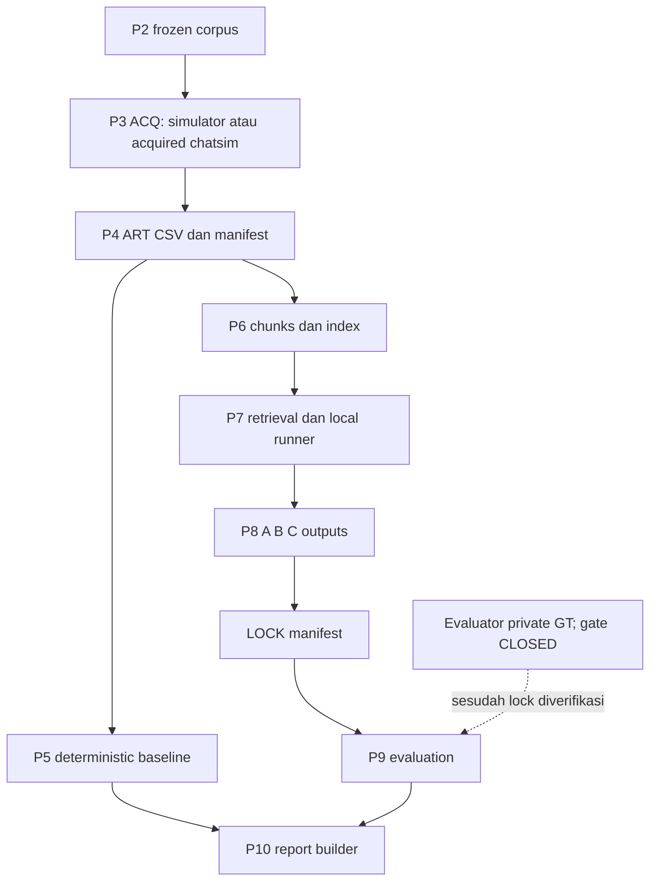
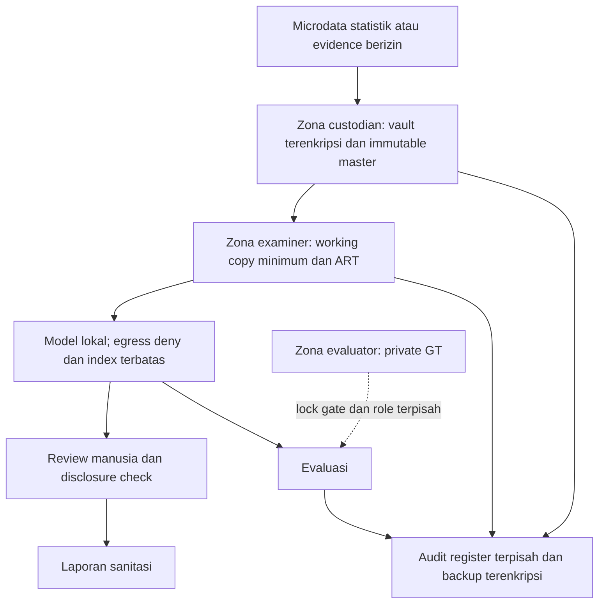

# LIBERA: Integritas Bukti Digital dan Evaluasi Bantuan Local LLM pada Laboratorium Forensik

Status naskah: CANDIDATE. Kontrak 1.0. Naskah kerja untuk integrasi UAS, bukan laporan akhir siap dikumpulkan. GATE_REPORT_RESULTS_OPEN masih CLOSED; angka hasil belum diterbitkan. Bagian yang belum mempunyai bukti tercatat eksplisit sebagai BLOCKED, bukan diisi dengan hasil simulasi rekaan.

## Sampul

Program Studi Komputasi Statistik, Program Diploma IV, Politeknik Statistika STIS, 2026. Dosen pengampu: Farid Ridho (tercantum pada soal). Nomor kelompok, nama dan NIM lima anggota memerlukan konfirmasi anggota. Tidak diasumsikan bahwa nomor topik Digital Forensic merupakan nomor kelompok aktual.

# BAB I – Pendahuluan

## 1.1 Latar Belakang

Sistem informasi statistik mengelola data sejak pengumpulan hingga pengolahan dan penyajian. Ketika muncul dugaan perubahan data tanpa izin, organisasi memerlukan pemeriksaan yang mempertahankan sumber asli, menjelaskan asal setiap artefak, dan membedakan pengamatan dari interpretasi. Kerahasiaan melindungi isi bukti; integritas menjaga agar perubahan dapat diketahui; ketersediaan mendukung pemulihan dan pemeriksaan. Kebutuhan ini menempatkan forensik digital sebagai bagian dari pengelolaan insiden, bukan hanya pencarian kata dalam dokumen. NIST SP 800-86 membahas penggunaan teknik forensik dalam konteks insiden teknologi informasi [1].

LIBERA dirancang sebagai laboratorium kasus sintetis berbasis percakapan. Relevansinya bagi sistem informasi statistik berada pada pengamanan alur bukti, kontrol akses, dokumentasi pemeriksaan, dan tata kelola penanganan insiden. Kasus percakapan bukan microdata survei BPS; rancangan penerapan pada sistem statistik dalam Bab V harus dinyatakan sebagai usulan, bukan penerapan produksi.

Local LLM berpotensi membantu pemeriksa merangkum bukti. Namun keluaran yang lancar belum tentu didukung sumber. RAG menyediakan konteks hasil retrieval [2], sementara evaluasi klaim dan sitasi perlu dilakukan secara terpisah [3]–[5]. Eksekusi lokal dapat membatasi pengiriman isi bukti ke layanan eksternal, tetapi tidak dengan sendirinya membuktikan pengamanan perangkat atau kebenaran keluaran. Proyek ini menilai integritas dan keamanan pipeline sekaligus keterlacakan bantuan AI; keputusan pemeriksaan tetap harus ditinjau manusia.

## 1.2 Rumusan Masalah

- RQ1: Bagaimana acquisition dan extraction menghasilkan digital evidence yang dapat ditelusuri ke sumber serta mendeteksi perubahan bukti?
- RQ2: Kelemahan keamanan apa yang dapat direproduksi dalam lab, dan apakah perbaikan bertahan pada uji ulang?
- RQ3: Bagaimana P5 dan eksperimen A, B, C berbeda dalam ketepatan jawaban, dukungan bukti, dan biaya eksekusi pada benchmark terkunci?
- RQ4: Bagaimana rancangan pelindungan data, penanganan insiden, audit, dan arsitektur keamanan mendukung penerapan prinsip LIBERA pada sistem informasi statistik?

## 1.3 Tujuan Proyek

Tujuan terukur yang diusulkan ialah memverifikasi kesesuaian hash dan provenance pipeline; mereproduksi sedikitnya tiga kelemahan serta remediation/retest; membandingkan P5, A, B, C menggunakan task dan metrik yang dibekukan sebelum akses ground truth; dan menghasilkan checklist sedikitnya 15 kontrol serta sedikitnya lima temuan audit berbukti. Angka ini merupakan target persyaratan UAS, bukan hasil yang telah tercapai. W3 menetapkan rumus, denominator, aturan abstention dan batas interpretasi melalui protokol yang disetujui Coordinator.

## 1.4 Manfaat Proyek

Secara akademis, proyek menyediakan studi tentang hubungan integritas bukti dengan evaluasi keluaran AI. Secara praktis, dokumentasi acquisition, hash, pengujian ulang, dan pemisahan peran dapat membantu pembelajaran penanganan insiden. Manfaat terhadap organisasi statistik masih berupa rancangan yang perlu validasi pada kebutuhan organisasi dan data nyata berizin.

## 1.5 Ruang Lingkup dan Batasan

Objek adalah repository LIBERA dan lab sintetis berizin. Pipeline canonical adalah P2 → P3 → P4 → P5 → P6 → P7 → P8 → LOCK → P9 → P10. P5 adalah traditional deterministic forensic baseline; A Local LLM only; B Local LLM + RAG; C Local LLM + RAG + structured forensic output. A saat ini tidak menerima evidence kasus menurut kontrak; perbandingannya merupakan lower-bound design dan tidak mengisolasi efek retrieval pada input yang setara. Ancaman utama mencakup evidence tampering T1565.001 [8]; rincian ancaman lain mengikuti bukti W2. DEV-SIM/DEV-DRY harus disebut simulasi. Dry-run tidak membuktikan acquisition perangkat fisik maupun performa local LLM. Generalisasi di luar kasus, bahasa, perangkat, dan task yang diuji tidak diasumsikan.

# BAB II – Tinjauan Pustaka

## 2.1 Landasan Teori

CIA diterapkan pada seluruh alur bukti: akses terbatas menjaga kerahasiaan; hash dan pencatatan perubahan mendukung integritas; salinan terkendali dan pemulihan mendukung ketersediaan. Hash yang sama membuktikan kesamaan byte terhadap pembanding yang dipercaya, bukan kebenaran isi percakapan atau keabsahan hukum. Identifier ACQ-* mengacu paket acquisition, DEV-* sumber perangkat, ART-* artefak pemeriksa, dan FND-* interpretasi. Label penyusun corpus atau ground truth tidak boleh diperlakukan sebagai artefak hasil pemeriksaan.

NIST SP 800-86 menyediakan acuan teknik forensik [1]. NIST SP 800-61 Rev. 3 menghubungkan incident response dengan pengelolaan risiko dan menggantikan Rev. 2 [7]. ISO/IEC 27001:2022 adalah acuan sistem manajemen keamanan informasi, bukan sertifikasi yang otomatis diperoleh melalui checklist proyek [9]. NIST SP 800-218 memberi acuan praktik pengembangan aman [10], dan SP 800-53 Rev. 5 menyediakan katalog kontrol keamanan serta privasi [11]. Pemetaan Annex A dan hukum Indonesia harus diverifikasi oleh W4 dari sumber berwenang; naskah ini tidak menyatakan kepatuhan organisasi yang belum diaudit.

RAG memisahkan retrieval atas sumber dengan generation [2]. Supported claim mensyaratkan isi klaim didukung bukti yang dikutip, sedangkan unsupported claim tidak memiliki dukungan memadai atau melampaui bukti. Validitas ART ID dan JSON bukan pemeriksaan semantik. Structured forensic output mendukung keterbacaan dan pemeriksaan otomatis, tetapi tetap memerlukan penilaian isi. Ground truth digunakan evaluator setelah keluaran P8 dikunci, bukan sebagai konteks examiner.

## 2.2 Penelitian/Proyek Terkait

Tabel 2.1. Perbandingan kritis rujukan primer dan implikasi desain LIBERA. Sumber: [2]–[6]; merupakan interpretasi desain, bukan bukti hasil LIBERA.

|Rujukan|Fokus yang diverifikasi|Implikasi bagi LIBERA|Batas transfer|
|---|---|---|---|
|Lewis et al. [2]|RAG menggabungkan model parametrik dengan memory hasil retrieval|Sediakan evidence ART sebagai konteks B/C|Eksperimen Wikipedia/open-domain tidak membuktikan akurasi forensik Indonesia|
|Es et al. [3]|Ragas memisahkan dimensi retrieval dan generation tanpa selalu membutuhkan anotasi GT|Laporkan kualitas retrieval dan dukungan keluaran secara terpisah|LLM judge bukan pengganti evaluator independen; metric LIBERA tidak otomatis bernama Ragas|
|Min et al. [4]|FActScore menilai dukungan pada klaim atomik|Pisahkan satu jawaban menjadi klaim yang dapat diperiksa|Skor biografi dan knowledge source berbeda dari relevansi bukti kasus; metode adaptasi harus dijelaskan|
|Gao et al. [5]|ALCE menilai correctness dan citation quality|Periksa kecocokan isi klaim dengan ART, bukan sekadar keberadaan ID|Sitasi valid secara struktur belum tentu lengkap atau mendukung kesimpulan hukum|
|Liu et al. [6]|Posisi informasi dalam konteks panjang memengaruhi pemanfaatannya|Catat urutan chunk, batas konteks, dan retrieval trace|Temuan paper bukan bukti top-k tertentu optimal untuk LIBERA|

Kelima studi ini menunjukkan perlunya memisahkan akses bukti, kualitas retrieval, ketepatan jawaban, dan dukungan klaim. Kontribusi yang hendak diuji LIBERA adalah penggabungan evaluasi tersebut dengan provenance serta kontrol integritas lab. Kebaruan ilmiah atau keunggulan performa belum dinyatakan sebelum pengujian dan telaah tambahan.

## 2.3 Teknologi dan Tools

Pemilihan komponen mengikuti fungsi yang dapat diuji: Python untuk pipeline dan evaluasi; hash SHA-256 untuk pembanding integritas; Git untuk versioning kode serta evidence publik yang disanitasi; local LLM runtime untuk eksekusi inference; retrieval untuk menyediakan ART; schema keluaran untuk validasi struktur. Nama model, digest, versi runtime, platform dan dependensi harus berasal dari manifest W1/W3. Scan kode mendukung pencarian kelemahan [10], tetapi setiap temuan memerlukan verifikasi W2. Pustaka, model atau perangkat yang hanya direncanakan tidak ditulis sebagai telah digunakan.

# BAB III – Metodologi

## 3.1 Tahapan Pelaksanaan

Studi literatur dan kontrak mendahului pemeriksaan fondasi W1, uji keamanan W2, dan registrasi benchmark W3. P8 harus selesai dengan runtime sebenarnya serta manifest hash sebelum Coordinator membuka GATE_GT_ACCESS. Evaluasi P9 tidak mengubah keluaran P8. W4 menyusun governance berdasarkan bukti dan W5 mengintegrasikan fakta yang dipromosikan.

## 3.2 Arsitektur/Desain Sistem

Fondasi canonical W1 menggunakan sumber corpus sintetis P2 yang dipertahankan, paket acquisition P3, artefak pemeriksa P4, dan baseline deterministic P5. Ini merupakan acquisition simulasi; tidak dilakukan klaim ekstraksi telepon fisik. Corpus/acquisition sumber dibedakan dari working outputs; ground truth evaluator dirancang berada di luar Git dan tidak digunakan oleh examiner dalam run sesi ini. Pemisahan akses run tidak membuktikan strict blindness terhadap konteks konstruksi kasus publik; paparan historis/schema masih perlu diaudit. Local LLM hanya dijalankan setelah evidence P4 disetujui, sedangkan evaluasi P9 berada di sisi evaluator setelah LOCK. Detail boundary isolasi host/network dan diagram final mengikuti evidence W4; eksekusi lokal saja belum membuktikan sandbox jaringan.

Tabel 3.1. Interface fondasi canonical. Sumber: kontrak 1.0 dan W1 runtime_summary.json (claim W1-001–W1-003).

|Tahap|Input/output canonical|Prinsip pemeriksaan|
|---|---|---|
|P2|data/adaptasi_indonesia/corpus_whatsapp_10000.csv|Sumber sintetis immutable; pembanding hash dari Coordinator|
|P3|Paket ACQ-* dari sumber sintetis, device simulasi DEV-*|Sumber asli tidak ditimpa; acquisition bukan ground truth|
|P4|runtime/working/P4/artifacts.csv|ART-* mempunyai acquisition_id, device_id, message_id, conversation_id dan timestamp_normalized|
|P5|baseline_findings.json, baseline_manifest.json, entities.csv, relationships.csv, timeline.csv|Deterministic rules, terpisah dari inference LLM|

Schema P4 memuat evidence_id, artifact_id, acquisition_id, device_id, message_id, conversation_id, segment_id, sender, receiver, timestamp_normalized, message_text, message_type, reply_to_message_id dan attachment_id. FND-* menyatakan interpretasi dengan referensi ART; identifier yang ditemukan tidak otomatis merupakan klaim semantik yang benar.

## 3.3 Skenario Pengujian

Skenario fondasi yang telah diterima Coordinator memeriksa preservasi sumber, penolakan alias path, dan determinisme baseline. Rancangan uji tersebut tidak menggunakan label evaluator. Tabel ini menyatakan metode, bukan metrik akhir Bab IV.

Tabel 3.2. Skenario fondasi. Sumber: claim canonical W1-001–W1-003.

|ID|Target dan langkah|Kriteria|Batas|
|---|---|---|---|
|F-01|Jalankan P3/P4/P5 pada sumber sintetis dengan output working terpisah; bandingkan hash sumber sebelum/sesudah|Corpus dan paket acquisition tetap identik|Preservasi byte bukan kebenaran isi|
|F-02|Coba path output sama dengan sumber, termasuk symlink/hardlink pada extraction|Konfigurasi ditolak sebelum penulisan yang merusak|Tidak menguji hostile concurrent filesystem|
|F-03|Jalankan baseline dua kali dengan ART/task tidak berubah; bandingkan baseline_findings.json|Finding JSON identik byte|Manifest bertimestamp dapat berbeda; bukan accuracy test|

Protokol W2 menambahkan reproduksi kelemahan, perbaikan dan retest sesuai RoE; protokol W3 menambahkan benchmark P5/A/B/C. Konfigurasi yang diusulkan W3 menggunakan qwen2.5:1.5b dan bge-m3, top-k 8, seed 42, temperature 0.1, context 8192; ketersediaan model tidak terbukti. B/C berbagi retrieval dan log wajib menyimpan prompt, trace, model digest, konfigurasi, code SHA serta hardware. Lock menolak stub/error/hasil kosong/provenance model tidak lengkap dan overwrite; Coordinator tetap harus memeriksa bukti runtime. P9 message-level selection metrics bukan penilaian dukungan semantik. Review semantik diusulkan dengan dua reviewer, label supported/unsupported/indeterminate dan rekonsiliasi; review tersebut belum dilakukan. W3-ENV memverifikasi Ollama executable tidak tersedia dan API lokal menolak koneksi di lingkungan sesi ini, bukan pada laptop pengguna. Metrik AI wajib menyebut unit analisis, denominator dan aturan jawaban kosong. Waktu eksekusi memerlukan mesin dan konfigurasi; dry-run tidak dibandingkan sebagai inference. Benchmark final dan evaluasi hasil tetap BLOCKED sebelum gate yang relevan terbuka.

## 3.4 Etika Pengujian dan Rules of Engagement

BLOCKED untuk RoE final sampai target, jadwal dan penanggung jawab nyata disetujui. Pengujian hanya pada salinan sintetis dan target lab yang diizinkan; bukan layanan publik. Pernyataan Etika perlu tanda tangan seluruh anggota. Worker AI bukan penandatangan atau anggota kelompok.

# BAB IV – Hasil Implementasi dan Pengujian

## 4.1 Implementasi Pengamanan

BLOCKED: integrasikan konfigurasi before/after W1/W2 dengan command, versi dan hash evidence setelah verifikasi Coordinator.

## 4.2 Hasil Pengujian dan Analisis Kerentanan

BLOCKED: sedikitnya tiga finding terverifikasi W2, masing-masing dengan kondisi, risiko beserta alasan, akar penyebab, remediation, retest dan keterbatasan. Rencana uji tidak dihitung sebagai temuan.

## 4.3 Analisis Malware/Ancaman

BLOCKED: analisis ancaman safe evidence tampering memerlukan sampel sintetis, hash, static/dynamic evidence, IoC dan pemetaan T1565.001 [8]. Sebut sebagai simulasi ancaman, jangan menyebut malware nyata jika tidak digunakan.

## 4.4 Evaluasi

BLOCKED: GATE_REPORT_RESULTS_OPEN CLOSED. Tidak ada tabel hasil final. Setelah dibuka, setiap angka ditautkan claim_id, artefak sumber, commit, denominator, dan script perhitungan. Jangan menuliskan peningkatan, keunggulan atau keberhasilan tanpa hasil yang mendukung.

# BAB V – Rancangan Pengelolaan Keamanan Data dan Layanan TI

## 5.1 Pelindungan data dan DPIA

UU 27/2022 Pasal 1 menilai identifiabilitas termasuk kombinasi informasi; Pasal 20 mengatur dasar pemrosesan, Pasal 34 penilaian dampak bagi pemrosesan berisiko tinggi, Pasal 35–39 keamanan, dan Pasal 42–45 pengakhiran serta penghapusan. Pasal 46 mewajibkan pemberitahuan tertulis paling lambat 3 x 24 jam kepada subjek dan lembaga; isi minimal mencakup data terungkap, waktu/cara pengungkapan, serta penanganan/pemulihan. Pengecualian Pasal 50 bukan izin otomatis bagi tugas kuliah. Rujukan: [JDIH Komdigi, UU 27/2022](https://jdih.komdigi.go.id/produk_hukum/view/id/832/t/undangundang%20nomor%2027%20tahun%202022), diperiksa 3 Oktober 2026. Penentuan pengendali, dasar hukum, dan izin data nyata belum tersedia: BLOCKED untuk penggunaan nyata.

Konteks statistik: UU 16/1997 Pasal 21 mewajibkan kerahasiaan keterangan responden; Pasal 24 meneruskannya bagi petugas dan Pasal 23 mengatur penyampaian hasil sebagaimana adanya. Ini menjadi dasar kebutuhan arsitektur target statistik, bukan pernyataan bahwa chat sintetis LIBERA merupakan survei resmi BPS. Rujukan [salinan BPS](https://ppid.bps.go.id/upload/doc/UU_Nomor_16_Tahun_1997_tentang_Statistik_1726565451.pdf), Pasal 21–24, diperiksa 3 Oktober 2026.

### Register pemrosesan dan klasifikasi rancangan

| Data/proses | Tujuan dan penerima | Klasifikasi rancangan | Batas dan perlakuan |
|---|---|---|---|
| P2 corpus sintetis | Simulasi dan pengujian fondasi oleh W1 | Internal riset; distribusi sesuai izin sumber | Beku; hash tidak diganti; jangan menyatakan seluruh aset repo bebas data pribadi tanpa audit terpisah |
| ACQ master, DEV metadata, chain of custody | Menelusuri sumber oleh examiner | Terbatas; sangat rahasia apabila nyata | Usulan master read-only, akses custodian, salinan kerja; hash bukan enkripsi |
| P4 ART message_text, sender, timestamp | Analisis deterministik/RAG examiner | Terbatas; potensi identifikasi ulang jika nyata | Saring kolom sesuai contract; minimisasi laporan bukan mengubah master |
| Index, prompt, output FND | Analisis model lokal dan reviewer | Sama dengan bahan paling sensitif | Index/embedding tidak dianggap anonim; local host default bukan bukti tanpa trafik keluar |
| Ground truth evaluator | P9 setelah LOCK | Sangat terbatas | Tidak dibuka W4; isolasi dari examiner dan Git |
| Laporan publik | Dosen/pembaca | Publik setelah review | Kutipan minimal, pseudonim, tanpa kontak/NIK/alamat nyata; checker identifiabilitas |
| Usulan microdata responden statistik | Investigasi insiden institusi oleh tim berizin | Sangat rahasia | Bukan input studi ini; dasar hukum, mandat, retensi dan SOP harus disahkan lebih dahulu |

Alur DPIA rancangan: dokumentasikan mandat dan tujuan spesifik; inventaris semua data turunan; nilai kebutuhan setiap kolom; tentukan pengendali/prosesor serta penerima; periksa hak subjek dan risiko; pilih kontrol; uji kontrol; minta persetujuan penanggung jawab sebelum data nyata. Consent tidak otomatis menjadi dasar yang tepat untuk forensik. Penggunaan teknologi baru, data spesifik, skala besar, atau keputusan berdampak signifikan harus diperiksa terhadap Pasal 34, bukan diasumsikan dari label “AI”. Temuan LLM diperiksa manusia dan tidak menjadi keputusan terhadap orang secara otomatis.

### Risiko DPIA: skor analitis rancangan

Skala kemungkinan L dan dampak I masing-masing 1–5; R=L×I. 1–4 rendah, 5–9 sedang, 10–15 tinggi, 16–25 kritis. Angka merupakan penilaian penulis, bukan pengukuran frekuensi atau probabilitas insiden. Residual adalah target setelah verifikasi kontrol, bukan nilai kondisi akhir.

| Risiko dan pihak terdampak | L,I,R awal | Mitigasi usulan dan pemilik fungsional | Residual target | Bukti penerimaan yang dibutuhkan |
|---|---|---|---|---|
| Pengungkapan chat/contact kepada pihak tak berizin; subjek/korban | 4,5,20 | Custodian: ACL, disk encryption, offline processing, ekspor tersaring | 2,5,10 | Uji akses ditolak, bukti enkripsi dan review ekspor |
| Reidentifikasi dari lokasi/waktu/relasi; responden | 4,4,16 | Privacy reviewer: minimisasi, generalisasi, manual disclosure review | 2,4,8 | Uji quasi-identifier pada output representatif |
| FND tidak didukung menuduh seseorang; subjek | 3,5,15 | Examiner/reviewer: ART citations, penilaian semantik, uncertainty, human signoff | 2,5,10 | Review claim-level; bukan sekadar ART ID ada |
| Tampering master/hasil; pemeriksa dan proses akademik | 3,5,15 | Custodian: master immutable, hash di register terpisah, chain of custody | 1,5,5 | Tamper test dan restore; reviewer independen |
| GT terbaca sebelum lock; validitas riset | 3,4,12 | Coordinator/evaluator: gate dan kontrol akun terpisah | 1,4,4 | Manifest terkunci, hash dicek; catat kebocoran historis |
| Retensi terlalu lama atau penghapusan saat legal hold | 3,4,12 | Pengendali: jadwal retensi, hold, log penghapusan, backup expiry | 1,4,4 | Kebijakan disahkan dan uji siklus data |

Usulan retensi: berkas studi sintetis mengikuti kebutuhan penilaian dan lisensi sumber; data nyata mengikuti jadwal arsip sah/mandat perkara. Tidak menetapkan masa universal atau menghapus bukti saat legal hold. Permintaan hak subjek masuk register, diverifikasi identitas, diputus pihak berwenang, dibatasi agar tidak membuka informasi pihak lain, dan dicatat alasannya. Local LLM tidak menghapus kewajiban atas chat, embedding, cache dan laporan.

### Pelindungan yang benar-benar diukur

`python tools/governance_uas_demo.py --output docs/08_uas/evidence/W4` menjalankan satu fixture yang secara eksplisit sintetis. `governance_demo.json` menyediakan bukti minimisasi field identifier langsung, pembatasan mode filesystem, deteksi perubahan salinan dan pemulihan hash backup. Angka hasil demonstrasi belum diterbitkan dalam draf ini karena gate hasil CLOSED. Pengujian ini hanya demonstrasi kontrol, tidak mengubah pipeline canonical, tidak menguji pengguna penyerang, enkripsi, reidentifikasi, data nyata atau jaminan anonimitas. Bukti enkripsi dan efektivitas ACL institusi: BLOCKED karena lingkungan target belum disediakan.

## 5.2 Playbook respons insiden

Rujukan terkini yang diperiksa adalah [NIST SP 800-61 Rev. 3](https://csrc.nist.gov/pubs/sp/800/61/r3/final), April 2025, DOI [10.6028/NIST.SP.800-61r3](https://doi.org/10.6028/NIST.SP.800-61r3), menggantikan Rev. 2. Kerangka mengintegrasikan respons dalam CSF 2.0. Playbook ini menggunakan Govern/Identify/Protect untuk kesiapan serta Detect/Respond/Recover untuk insiden; perbaikan mengalir ke siklus berikut. Tidak menyebut empat tahap Rev.2 sebagai model terbaru.

| Fungsi | Trigger/keputusan | Aksi dan bukti | Penanggung jawab fungsional |
|---|---|---|---|
| Govern/Identify/Protect | Sebelum pemrosesan | Asset/data register, mandat, role, dependency, backup, kontak eskalasi, larangan GT sebelum LOCK | Coordinator dan custodian |
| Detect | Hash mismatch, akses tak berizin, keluaran asing | Stop penggunaan output; cap waktu, simpan sumber dan hash; nilai confidence tanpa mengubah master | Examiner |
| Respond: triage | Kejadian integritas atau kemungkinan kebocoran | Tentukan severity dan cakupan; buka incident ID; pisahkan observasi dari dugaan | Incident lead |
| Respond: containment | Risiko berlanjut | Isolasi salinan/host, blok akses keluar bila perlu; preserve log sebelum rotasi/eradikasi; jangan menghapus master atau Git history | Custodian |
| Respond: komunikasi | Kemungkinan kegagalan PDP nyata | Pengendali/legal review menyiapkan notifikasi ke subjek dan lembaga; operational clock konservatif dari deteksi, tidak tunggu root cause lengkap | Pengendali, privacy/legal reviewer |
| Respond: eradication | Sumber diketahui cukup | Revoke akses/credential, patch pemilik domain, review ulang input; simpan before/after | Security owner |
| Recover | Backup dan kontrol tervalidasi | Restore ke lokasi baru, hash-check, rerun extraction/retest; jangan menimpa lock studi lama | Custodian/Coordinator |
| Improvement | Setelah containment/recovery | Catat akar penyebab, action owner, tenggat, acceptance test; management review | Coordinator |

Severity usulan: kritis untuk disclosure bukti nyata atau master tidak tepercaya; tinggi untuk tampering working copy atau GT leakage; sedang untuk error tanpa dampak integritas/kebocoran. Keputusan ini rulebook rancangan, bukan insiden produksi yang telah diamati. T1565.001 digunakan W2 untuk tampering data tersimpan; W4 tidak menyatakan attribution pelaku.

Notifikasi rancangan memuat incident ID; jenis data terungkap; waktu dan mekanisme diketahui; cakupan/ketidakpastian; tindakan pemulihan; kontak; pembaruan lanjutan. Jangan lampirkan raw chat atau menunggu hasil model. Pasal 46 berlaku bila terjadi kegagalan PDP; tabletop sintetis tidak memicu surat nyata. Pengecualian atau identitas lembaga penerima aktual harus disahkan pihak berwenang pada kasus nyata. Tidak ada pesan yang dikirim oleh W4.

### Tabletop yang dijalankan dan batasnya

Bukti `governance_demo.json` adalah AUTOMATED_SYNTHETIC_TABLETOP_NOT_TEAM_DRILL. Script menulis satu salinan kerja, mengubah byte, mendeteksi mismatch dan memulihkan backup. Timeline keputusan hipotetis mencakup stop/preserve/isolate, triage, assessment disclosure, draft pemberitahuan dan restore. Urutan serta waktu merupakan input skenario, bukan waktu respons manusia atau insiden historis. Hasil numerik demonstrasi ditunda sampai gate hasil dibuka; latihan peserta tim, tanda tangan, komunikasi eksternal dan recovery SLA nyata: BLOCKED sampai tim mengadakan latihan. Pelajaran dari run: hash mendeteksi perubahan tetapi belum menjamin keaslian jika register ikut diubah; backup perlu trust boundary terpisah; minimisasi identifier masih menyisakan quasi-identifier; lock invalid tidak boleh diganti diam-diam.

## 5.3 Audit ISO/IEC 27001:2022

Ini audit kesiapan akademik atas modul tertentu, bukan audit sertifikasi. [ISO metadata edisi 2022](https://www.iso.org/standard/27001) diverifikasi; catatan Amendment 1:2024 ada pada katalog. Annex A adalah referensi kontrol; penerapan dipilih melalui penilaian risiko dan Statement of Applicability. [ISO/IEC 27002:2022](https://webstore.iec.ch/en/publication/74287) adalah panduan kontrol. Tabel berikut ringkasan penulis; teks penuh standar berlisensi tidak tersedia di sesi sehingga validasi normatif lengkap tetap BLOCKED, tidak diganti dengan blog atau status sertifikasi.

Status tabel: VERIFIED_BY_WORKER hanya berarti fakta inspeksi yang dibatasi pada source_inventory; CANDIDATE berarti kontrol diusulkan, bukan diterapkan. Semua kontrol relevan karena pemrosesan bukti/raw text/hasil AI. Register formal SoA dan pengecualian memerlukan approval institusi.

| Annex A | Ringkasan kontrol (parafrasa) | Bukti/kondisi teramati | Status dan tindak lanjut |
|---|---|---|---|
| 5.9 | Inventaris aset | source_inventory mencatat 12 modul | VERIFIED_BY_WORKER; tambah owner/klasifikasi semua aset |
| 5.12 | Klasifikasi informasi | Matriks rancangan V.1 | CANDIDATE; sahkan label dan rules |
| 5.15 | Aturan akses | .gitignore mengecualikan runtime | VERIFIED_BY_WORKER; bukan ACL; pisahkan akun/role |
| 5.18 | Siklus hak akses | Tidak diperiksa pada host organisasi | CANDIDATE; approval/revoke/review akses |
| 5.24 | Persiapan respons insiden | Playbook V.2 dan demo | VERIFIED_BY_WORKER untuk demo; latihan tim belum ada |
| 5.25 | Penilaian kejadian | Keputusan tamper di tabletop | VERIFIED_BY_WORKER untuk simulasi; role nyata belum disahkan |
| 5.26 | Respons insiden | Isolasi/preserve/restore rancangan | CANDIDATE; uji playbook organisasi |
| 5.27 | Belajar dari insiden | Empat pelajaran demo V.2 | VERIFIED_BY_WORKER untuk demo; review tim diperlukan |
| 5.28 | Pengumpulan bukti | acquisition_simulator/extract_artifacts memuat hash/provenance | VERIFIED_BY_WORKER untuk keberadaan kode; acquisition fisik belum dibuktikan |
| 5.31 | Persyaratan hukum | Register UU dan standards W4 | VERIFIED_BY_WORKER untuk referensi; penilaian legal nyata belum ada |
| 5.34 | Privasi/PII | DPIA dan fixture minimisasi | VERIFIED_BY_WORKER untuk demo; bukan compliance statement |
| 8.9 | Pengelolaan konfigurasi | p6_p7_config dan parameter CLI | VERIFIED_BY_WORKER; pin versi/digest dan kontrol perubahan |
| 8.10 | Penghapusan informasi | Tidak ada lifecycle penghapusan pada modul yang diperiksa | CANDIDATE; retensi/legal hold/backup expiry |
| 8.11 | Masking data | Demo field suppression; angka hasil ditunda | VERIFIED_BY_WORKER; uji quasi-identifiers; jangan ubah master |
| 8.12 | Pencegahan kebocoran | runtime/GT gitignore; host default localhost | VERIFIED_BY_WORKER; ACL dan egress terpisah belum dibuktikan |
| 8.13 | Cadangan informasi | Exact hash restore fixture | VERIFIED_BY_WORKER untuk fixture; off-device recovery belum ada |
| 8.15 | Pencatatan aktivitas | run_log append_jsonl tanpa locking | VERIFIED_BY_WORKER; perlu integrity/rotation/access control |
| 8.24 | Kriptografi | SHA-256 source evidence; tidak membuktikan encryption | VERIFIED_BY_WORKER; desain kunci dan disk encryption diperlukan |
| 8.32 | Pengendalian perubahan | Branch ownership dan contract 1.0 | VERIFIED_BY_WORKER untuk dokumen; Coordinator review/merge gates |

### Lima temuan audit yang dapat direproduksi

Temuan gap terbatas pada kode baseline yang diperiksa; tidak menyatakan suatu organisasi melanggar ISO. Dampak/severity penilaian penulis. Tidak menghitung lima gap ini sebagai temuan penetration test W2.

| ID; kontrol | Kondisi dan bukti | Kriteria/risiko; penilaian | Remediasi usulan; acceptance test |
|---|---|---|---|
| GOV-01; 8.15/5.28 | `src/ai_rag/run_log.py` append_jsonl memakai `open('a')`, docstring menyatakan tanpa locking; tidak ada hash chain/signature di fungsi | Log dapat diedit oleh akun pemilik; reliability concurrency dan provenance. Tinggi jika bukti nyata | W3 via request: write lock dan integrity register; tamper dan concurrent append tests |
| GOV-02; 8.12/5.34 | `ollama_runner.py` default localhost tetapi `_post` menerima URL dari host; `run_experiment.py --host` bebas pada baseline | “local” tidak otomatis membatasi egress. Tinggi bila endpoint salah | W3/W2: allowlist loopback/offline profile; reject remote host di mode bukti nyata; mock test tanpa jaringan |
| GOV-03; 5.15/5.18 | `.gitignore` mengecualikan runtime/private tetapi program menulis file dengan Path.write_text; tidak mengatur examiner/evaluator ACL pada kode ini | Gate prosedural dan ignore bukan pembatas akses filesystem. Tinggi untuk blindness/PII | Coordinator/custodian: akun/vault terpisah; akses GT ditolak sebelum gate; negative access test |
| GOV-04; 8.24/5.34 | `run_experiment.py` menyimpan JSON UTF-8 via write_text; `extract_artifacts.py` mengeluarkan CSV message_text; tidak ada encryption-at-rest di writer yang diperiksa | Data turunan mewarisi sensitivitas raw data. Tinggi bila nyata; enkripsi host di luar cakupan | Custodian: encrypted volume/key management; uji read tanpa key dan recovery; hash saja tidak cukup |
| GOV-05; 8.10/8.13 | `run_log.py append_jsonl` selalu menambah; `run_experiment.py` menulis output tanpa TTL/retensi; tidak ada backup lifecycle di kedua modul | Pertumbuhan/sisa output dan pemulihan belum dikelola pada writer. Sedang | Coordinator/custodian: retensi disahkan/hold, cleanup turunan/backup; restore plus expiry test |

Reproduksi: inspect file persis dari source_inventory dan bandingkan SHA. Komando inspeksi `rg -n 'open|write_text|host|lock|encrypt|unlink|retention' src/ai_rag/run_log.py src/ai_rag/ollama_runner.py src/ai_rag/run_experiment.py src/forensics/extract_artifacts.py .gitignore`. Hasil temuan merupakan kode+inspeksi, bukan eksploitasi live. Setelah merge W2/W3, tandai resolved hanya dengan retest, jangan menghapus catatan before-state.

Catatan kondisi integrasi yang telah dipromosikan: GOV-02 merupakan observasi baseline. W3-TRANSPORT kini menegakkan loopback-only transport, proxy disabled dan redirect rejection; W2-CANONICAL-OWNER-RETEST membuktikan guard menolak probe remote/redirect sintetis. Cakupan ini bukan pengujian firewall atau inspeksi trafik host nyata. GOV-01, GOV-03, GOV-04 dan GOV-05 tidak otomatis selesai oleh perubahan tersebut. W3-LOCK dan W3-NESTED-GT memperkuat lock/schema; keduanya tidak membuktikan ACL antar akun, enkripsi, log immutable, validitas semantik, atau retensi. Label VERIFIED_BY_WORKER pada checklist di atas mengacu scope inspeksi baseline; penerimaan canonical hanya berlaku pada claim yang tercantum di Fact Matrix, bukan seluruh kontrol institusi.

## 5.4 Arsitektur dan roadmap

Diagram pertama memetakan hubungan implementasi berdasarkan modul inventory. P3/P4 simulasi dan mode fisik harus dibedakan saat melaporkan hasil. Keberadaan jalur kode tidak membuktikan seluruh tahap dieksekusi. Device dan physical acquisition tidak diklaim W4.

P5 bukan LLM; A tidak menerima case evidence menurut contract; B/C berbagi retrieval; C meminta structured forensic output. Log berada pada host yang sama; ini batas kepercayaan lemah. Ollama berjalan lokal menurut default kode tetapi run aktual/digest/outbound traffic harus dibuktikan W3. Gate adalah keputusan Coordinator, bukan diagram yang otomatis menegakkan ACL.

Diagram target berikut merupakan usulan adaptasi lingkungan statistik, bukan deployment LIBERA pada BPS.

Target menambah trust boundary custodian/examiner/evaluator, bukan mengganti contract pipeline. Microdata tidak dimasukkan ke model sebelum mandat, legal review, klasifikasi dan DPIA disahkan. Tidak mengasumsikan anonymization dari pseudonim atau embeddings.

| Horizon usulan | Risiko prioritas | Tindakan; pemilik | Exit criteria |
|---|---|---|---|
| Sebelum demo UAS | Salah klaim akuisisi/hasil model; GT leakage | Coordinator/W1/W3: modes jelas, hash P2, gates, lock, faktual report | Canonical facts dan raw execution evidence diverifikasi |
| Sebelum data nyata | Disclosure, egress, akses evaluator | Pengendali/custodian/W2: mandat+DPIA, akun terpisah, encryption, loopback dan egress deny | Legal approval; negative access/outbound tests; encryption evidence |
| Dalam 30 hari setelah lingkungan target tersedia | Log tampering, recovery failure | Custodian/W3: register log independen, backup, restore drill | Tamper detection dan recovery SLA diukur; reviewer signoff |
| Dalam 60–90 hari | Retensi dan kesiapan insiden | Privacy lead/incident lead: SoA, schedule, tabletop manusia, kontak notifikasi | Minutes nyata, actions closed, expiry+hold test |
| Tiap perubahan besar | Model drift, hasil tak didukung | Coordinator/W3/reviewer: study baru, benchmark preregistered, recalculation | Lock study baru; semantic groundedness review dan report update |

# BAB VI – Jadwal Pelaksanaan dan Pembagian Tugas

## 6.1 Jadwal Pelaksanaan

Soal dibagikan 1 Oktober 2026 dan deadline 5 Oktober 2026 pukul 13.30 WIB. Tanggal tersebut merupakan ketentuan soal, bukan sejarah pekerjaan tim. Jadwal mingguan aktual dan rencana belum tersedia; git timestamp menunjukkan catatan perubahan, bukan bukti jam kerja anggota. Tabel realisasi final BLOCKED sampai log kegiatan dikonfirmasi tim.

|Periode yang perlu direkonsiliasi|Rencana yang perlu bukti|Realisasi yang perlu bukti|Sumber otorisasi|
|---|---|---|---|
|Minggu sebelum dan saat UAS|Rencana kelompok asli|Kegiatan anggota dan checkpoint|Log anggota, commit dan approval|

## 6.2 Pembagian Tugas

Ownership Worker dalam kontrak adalah pembagian workstream AI, bukan kontribusi lima mahasiswa. Nama, NIM, peran nyata dan persentase kontribusi BLOCKED sampai tim menyatakan dan menyetujui pembagiannya. Persentase tidak diambil dari jumlah commit atau diasumsikan 20% per orang.

# BAB VII – Kesimpulan dan Saran

Kesimpulan parsial: RQ1 mempunyai fondasi pemeriksaan simulasi yang diterima Coordinator. Preservasi corpus/acquisition, kontrol alias output dan determinisme finding P5 memiliki evidence W1-001–W1-003. Cakupannya tidak membuktikan acquisition telepon, akurasi inferensi atau chain of custody perangkat fisik. RQ2 mempunyai bukti guard dan retest sintetis W2, namun kesimpulan efektivitas aplikasi menyeluruh tetap memerlukan integration QA. RQ4 menghasilkan rancangan DPIA, incident response, audit readiness dan arsitektur target yang telah diterima Coordinator; demonstrasi minimisasi/restore tetap terbatas fixture. Penyelesaian ini bukan kepatuhan institusi, deployment BPS, latihan manusia atau sertifikasi ISO. RQ3 belum dapat dijawab sebagai perbandingan performa: real Ollama execution dan lock P8 belum ditetapkan, GT tetap tertutup, dan gate hasil masih CLOSED. Menyebut dry-run sebagai keberhasilan local LLM akan melampaui bukti.

Tidak tersedia dasar untuk menyatakan seluruh tujuan tercapai. Kesimpulan final BLOCKED hingga gate hasil dibuka. Kerangka jawaban yang wajib diselesaikan berbukti:

|RQ|Evidence yang diperlukan|Kondisi kesimpulan|
|---|---|---|
|RQ1|Manifest acquisition/extraction, hash, provenance dan uji tampering W1/W2|Nyatakan apa yang benar-benar terlacak; bedakan sumber simulasi/perangkat fisik|
|RQ2|Finding, perbaikan dan retest W2|Jawab kelemahan mana selesai dan residual risk|
|RQ3|P8 lock, manifest model, metric P9 W3|Bandingkan hasil sesuai denominator dan batas fairness A|
|RQ4|DPIA, tabletop, audit, arsitektur W4|Bedakan rancangan dengan efektivitas kontrol teruji|

Keterbatasan yang sudah perlu dipertimbangkan adalah kasus sintetis, kemungkinan paparan informasi desain kasus pada repository, A tanpa evidence kasus, serta kebutuhan validasi manusia. Keterbatasan aktual execution dicatat setelah integrasi. Saran yang diusulkan mencakup study baru dengan corpus belum terpapar, input baseline yang sebanding dan validasi pada data berizin; saran bukan komitmen implementasi.

# Daftar Pustaka (IEEE)

Metadata dan relevansi diverifikasi melalui halaman primer pada 3 Oktober 2026. Untuk paper, tahun merujuk versi arXiv yang dicantumkan; venue tidak direka.

[1] K. Kent, S. Chevalier, T. Grance, and H. Dang, “Guide to Integrating Forensic Techniques into Incident Response,” NIST SP 800-86, 2006. https://csrc.nist.gov/pubs/sp/800/86/final

[2] P. Lewis et al., “Retrieval-Augmented Generation for Knowledge-Intensive NLP Tasks,” arXiv:2005.11401, 2020. https://arxiv.org/abs/2005.11401

[3] S. Es, J. James, L. Espinosa-Anke, and S. Schockaert, “Ragas: Automated Evaluation of Retrieval Augmented Generation,” arXiv:2309.15217, 2023. https://arxiv.org/abs/2309.15217

[4] S. Min et al., “FActScore: Fine-grained Atomic Evaluation of Factual Precision in Long Form Text Generation,” arXiv:2305.14251, 2023. https://arxiv.org/abs/2305.14251

[5] T. Gao, H. Yen, J. Yu, and D. Chen, “Enabling Large Language Models to Generate Text with Citations,” arXiv:2305.14627, 2023. https://arxiv.org/abs/2305.14627

[6] N. F. Liu et al., “Lost in the Middle: How Language Models Use Long Contexts,” arXiv:2307.03172, 2023. https://arxiv.org/abs/2307.03172

[7] A. Nelson, S. Rekhi, M. Souppaya, and K. Scarfone, “Incident Response Recommendations and Considerations for Cybersecurity Risk Management: A CSF 2.0 Community Profile,” NIST SP 800-61 Rev. 3, 2025. https://csrc.nist.gov/pubs/sp/800/61/r3/final

[8] MITRE, “Stored Data Manipulation: T1565.001,” MITRE ATT&CK, accessed Oct. 3, 2026. https://attack.mitre.org/techniques/T1565/001/

[9] ISO, “ISO/IEC 27001:2022 — Information security management systems,” 2022. https://www.iso.org/standard/27001

[10] M. Souppaya, K. Scarfone, and D. Dodson, “Secure Software Development Framework (SSDF) Version 1.1,” NIST SP 800-218, 2022. https://csrc.nist.gov/pubs/sp/800/218/final

[11] NIST, “Security and Privacy Controls for Information Systems and Organizations,” NIST SP 800-53 Rev. 5, 2020, updates documented by publisher. https://csrc.nist.gov/pubs/sp/800/53/r5/upd1/final

[12] Republik Indonesia, “Undang-Undang Nomor 27 Tahun 2022 tentang Pelindungan Data Pribadi,” 2022. https://jdih.komdigi.go.id/produk_hukum/view/id/832/t/undangundang%20nomor%2027%20tahun%202022

[13] Republik Indonesia, “Undang-Undang Nomor 16 Tahun 1997 tentang Statistik,” 1997. https://ppid.bps.go.id/upload/doc/UU_Nomor_16_Tahun_1997_tentang_Statistik_1726565451.pdf

[14] ISO/IEC, “ISO/IEC 27002:2022,” 2022. https://webstore.iec.ch/en/publication/74287

# Lampiran dan Pengungkapan AI

Lampiran wajib: RoE, Pernyataan Etika bertanda tangan, cuplikan konfigurasi/log, screenshot autentik bernomor dan bersumber, hash sampel ancaman sintetis, checklist audit serta pengungkapan AI. Tidak tersedia lampiran tanda tangan; jangan membuat tanda tangan sintetis.

Pengungkapan sesi ini: ChatGPT Work digunakan sebagai alat bantu koordinasi, penelusuran sumber primer, penyusunan draf Bab I/II/VI/VII, pemeriksaan struktur UAS dan daftar evidence yang diperlukan. Draf belum merupakan persetujuan penulis manusia. Penggunaan AI oleh sesi/anggota lain harus ditambahkan dari catatan nyata beserta alat, tujuan dan bagian yang dibantu.

# Checklist penerbitan W5

- Semua hasil numerik harus mempunyai CANONICAL_VERIFIED claim_id dan sumber yang dapat dihitung ulang.
- Semua RQ dijawab pada VII dengan bukti IV/V; usulan tidak disebut telah diterapkan.
- Verifikasi citation in-text ↔ bibliography, nomor gambar/tabel, judul dan keterangan.
- Terapkan templat dosen asli; A4, Times New Roman 12 pt, spasi 1,5.
- Hitung halaman isi I–VII pada PDF hasil render; maksimum 30, kecuali sampul/daftar pustaka/lampiran.
- Konfirmasi seluruh identitas, nomor kelompok, realisasi dan kontribusi serta tanda tangan.
- Pastikan tidak ada BLOCKED atau placeholder pada laporan yang diberi label final; jika masih ada, nyatakan pekerjaan belum selesai.
- Nama PDF final mengikuti UAS_KSI_Kelompok[Nomor].pdf setelah nomor sah tersedia.

# Register sumber integrasi W5

Revisi ini dibaca dari checkout integration 89e11d7d7aabdcb43766210ab93de6e0cfbe8a8d. Fakta berasal dari 07_REPORT_FACT_MATRIX.md; interface dari 00_SHARED_CONTRACT.md. W1 runtime_summary.json: d1365eb96e60721276a10549ddc1f1998130f232; trusted_runtime_summary.json: 60ddffcdc68c7917cd9d948f5e9cea1453ef3969. W3_BENCHMARK_PROTOCOL.md dan environment.json: 64819a36c93cbc58a4654210c70a1f7e1f27f59c. W2 owner_retest.json: 1c7b60683c0a21035fbf8501616027a3a2b71bbd. W4_GOVERNANCE.md, W4_REFERENCES.md, governance_demo.json dan audit_observations.json: 4ae65d2cc624633dc755d97f9d2de3c7c5c4dce0. Nomor hasil final tetap ditunda, dan kondisi audit baseline ditandai terhadap perubahan integrasi.
